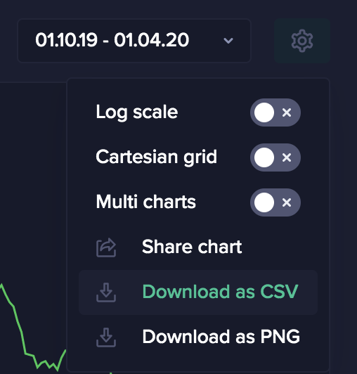

## Overview

The main questions that are being answered here are: `How to fetch data?` and
`What to do with the data?`.

- [Overview](#overview)
- [Different ways of obtaining data](#different-ways-of-obtaining-data)
- [GraphQL API](#graphql-api)
- [Download CSV from Sanbase](#download-csv-from-sanbase)
- [Analyzing Santiment Data](#analyzing-santiment-data)

## Different ways of obtaining data

Consuming Santiment data can be done in two main ways:

1. By using the **Sanbase Web Application**. Sanbase allows exploring the data through charts, research in written form of reports and insights and other visual tools.
2. By using the **Santiment API**. The API allows obtaining the data in a JSON format, which will be more suitable for developers.

## GraphQL API

If the desired metric is available in the API, using the API is the preferred way to
fetch the data. Detailed description and examples can be found on the [SanAPI page](/sanapi)

The API can be consumed in a few different ways:

- Using the [GraphiQL Live Explorer](https://api.santiment.net/graphiql) and
  explore the API with included autocmplete and nice response formatting.
- Using the `/graphql` API endpoint with `curl` directly from your terminal.
- Using the `/graphql` API endpoint and construct requests in your preferred
  programming language.
- Using the `sanpy` Python library that wraps the GraphQL API. It is easy to use
  and hides all GraphQL-related details.

## Download CSV from Sanbase

On [Sanbase](/sanbase) the data from charts can be exported as a CSV file. 

## Analyzing Santiment Data

Examples for different analysis based on Santiment data can be found on the
[Education and use cases page](/education-and-use-cases)

The are two types of examples included:

- Code examples showing how to analyze the data and plot the results.
- Descriptions how to use the tools provided by the Sanbase web application and interpret the results.
