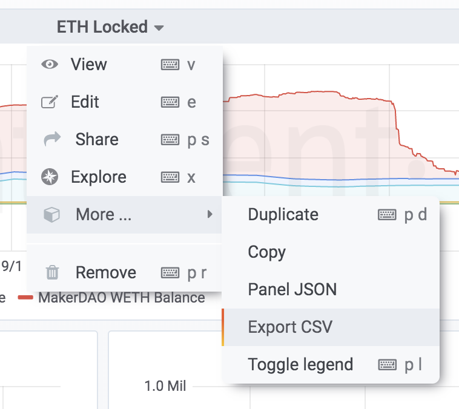

## Overview

The main questions that are being answered here are: `How to fetch data?` and `What to do with the data?`.

There are a few different ways to fetch and analyze data data:

- [Get data from the GraphQL API](#graphql-api)
- [Download CSV from Sanbase](#download-csv-from-sanbase)
- [Download CSV from Sandata](#download-csv-from-sandata)
- [Download CSV from Sangraphs](#download-csv-from-sangraphs)
- [Analyzing Santiment Data](#analyzing-santiment-data)

## GraphQL API

If the desired metric is available in the API using it is the preferred way to fetch data.
Detailed description and examples can be found on the [SanAPI page](/sanapi)

The API can be consumed in a few different ways:

- Use the [GraphiQL Live Explorer](https://api.santiment.net/graphiql) and explore the API with included autocmplete and nice response formatting.
- Use the `/graphql` API endpoint with `curl` directly from your terminal.
- Use the `/graphql` API endpoint and construct requests in your preferred programming language. There are examples in R, Ruby, Javascript and Elixir
- Use the `sanpy` Python library that wraps the GraphQL API. It is easy to use and hides all GraphQL-related details.

## Download CSV from Sandata

[Sandata](/sandata) contains metrics that are both available and not available in the API. All data from Sandata can be exported as a CSV file.

## Download CSV from Sanbase

[Sanbase](/sanbase) contains only data available in the API. Data from charts can be exported as a CSV file.

## Download CSV from Sangraphs

[Sangraphs](https://graphs.santiment.net) contains metrics that are both available and not available in the API. The social merics from Sangraphs can be exported as a CSV file from the bottom of the social page.

## Analyzing Santiment Data

Examples for different analysis based on Santiment data can be found on the [Education and use cases page](/education-and-use-cases)

The are two types of examples included:

- Jupyter Notebooks where code is written to analyze the data and plot results
- Descriptions how to interpert the chart data available in Santiment products
