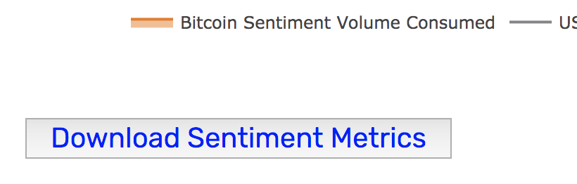

## Overview

The main questions that are being answered here are: `How to fetch data?` and
`What to do with the data?`.

There are a few different ways to fetch and analyze data data:

- [Overview](#overview)
- [GraphQL API](#graphql-api)
  - [GraphQL API Complexity](#graphql-api-complexity)
    - [Example](#example)
- [Download CSV from Sanbase](#download-csv-from-sanbase)
- [Download CSV from API no-code way](#download-csv-from-api-no-code-way)
- [Download CSV from Sangraphs](#download-csv-from-sangraphs)
- [Analyzing Santiment Data](#analyzing-santiment-data)

## GraphQL API

If the desired metric is available in the API using it is the preferred way to
fetch data. Detailed description and examples can be found on the [SanAPI
page](/sanapi)

The API can be consumed in a few different ways:

- Use the [GraphiQL Live Explorer](https://api.santiment.net/graphiql) and
  explore the API with included autocmplete and nice response formatting.
- Use the `/graphql` API endpoint with `curl` directly from your terminal.
- Use the `/graphql` API endpoint and construct requests in your preferred
  programming language. There are examples in R, Ruby, Javascript and Elixir
- Use the `sanpy` Python library that wraps the GraphQL API. It is easy to use
  and hides all GraphQL-related details.

### GraphQL API Complexity

The metric API queries like [this NVT example](../metrics/nvt/index.md#sanapi)
can potentially produce huge results (hundreds of thousands or millions of data
points) or produce queries that scan the whole database and spend too many
resources. Allowing such behavior opens doors to DoS attacks.

In order to guard against such behavior, every GraphQL request is analyzed
before being executed. The *complexity* for every query is computed, and if it
goes above the threshold, the API server rejects it and returns an error.
Roughly speaking, the complexity is proportional to the number of data points
returned.

More accurately, the complexity computation takes into consideration the
following:
- Number of data points returned - **N**. Fetching 30 days of data at daily
  intervals results in 30 data points.
- Number of fields in a data point - **F**. For most metrics, this includes two
  fields: **datetime** and **value**.
- Metric weight - **W**. Most of the metrics are stored in specialized fast data
  storage, so they have a smaller weight (0.3). The rest of the metrics have a
  weight of 1.
- Years time range span - **Y**. If the request is using a big interval (like 30
  days) the number of data points is small. However, the time range spans
  several years. The query still needs to read and aggregate a lot of data in
  the database.
- Subscription plan tier - **S**. The higher the user's plan, the bigger the
  complexity limit is (3 for Basic, 5 for Pro, 7 for Premium). As the complexity
  threshold is constant, the computed complexity is divided by **S**. This has
  the effect that the same query executed by a Pro user will have a 5 times
  smaller complexity than the same query executed by a Free user.

With the above-defined values, the complexity is computed by the following
formula: $$ Complexity(Q) := \dfrac{N(Q) * F(Q) * W(Q) * Y(Q)}{S(Q)} $$ where Q
is the query that is being analyzed, and N(Q)...S(Q) are the described values
computed on that query.

#### Example

Let us see how to compute the complexity when a SanAPI PRO subscription user
executes the following query.
```graphql
{
  getMetric(metric: "price_usd"){
    timeseriesData(slug: "bitcoin" from: "utc_now-3650d" to: "utc_now" interval: "1h"){
      datetime
      value
    }
  }
}
```

N(Q) = 3750 * 24 = 90000 - The time range is 3650 days and the interval is 1
hour. F(Q) = 2 - Every data point contains two fields - **datetime** and
**value**. W(Q) = 0.3 Y(Q) = 4 (Computed as: max(2022-2012, 2) / 2) S(Q) = 5

$$ Complexity(Q) := \dfrac{90000 * 2 * 0.3 * 4}{5} = 43200 $$

The complexity threshold is 50000, so this query passes the analysis, and the
API server executes it. If a SanAPI Free user executes this query, S(Q) = 1 and
the complexity will be over 210000. This will result in the following error:
```
Operation is too complex: complexity is 210241 and maximum is 50000
```


## Download CSV from Sanbase

[Sanbase](/sanbase) contains only data available in the API. Data from charts
can be exported as a CSV file. 

## Download CSV from API no-code way

[API](/neuro) has only json output format, but you can ease to use this
sample to get csv file. [CSV API Download Tool](https://colab.research.google.com/drive/1CdnHjL7Se_cO4dQj_PyXRpcZCIzus5SC#scrollTo=r3BZewx3K8Rb)

## Download CSV from Sangraphs

[Sangraphs](https://graphs.santiment.net) contains metrics that are both
available and not available in the API. The social merics from Sangraphs can be
exported as a CSV file from the bottom of the social page.


## Analyzing Santiment Data

Examples for different analysis based on Santiment data can be found on the
[Education and use cases page](/education-and-use-cases)

The are two types of examples included:

- Jupyter Notebooks where code is written to analyze the data and plot results
- Descriptions how to interpert the chart data available in Santiment products
