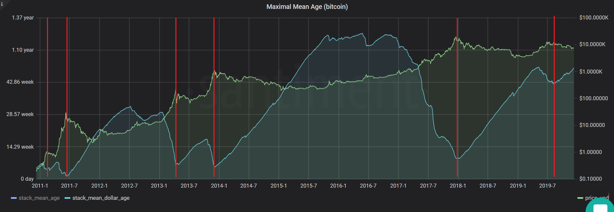
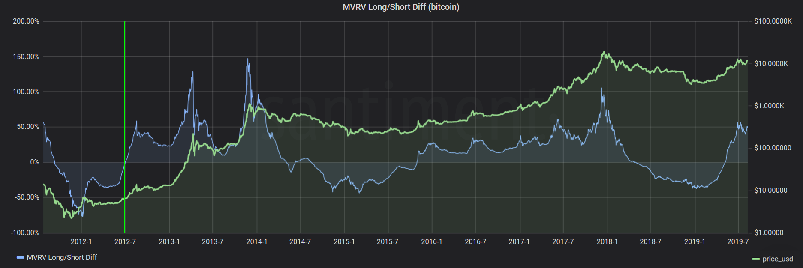
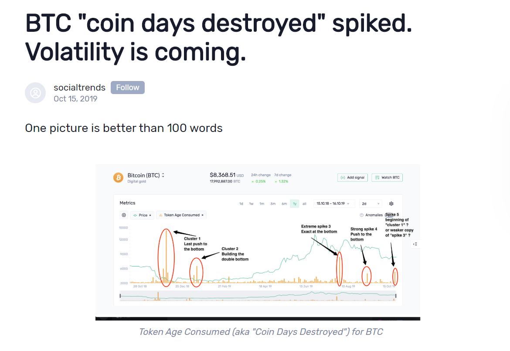
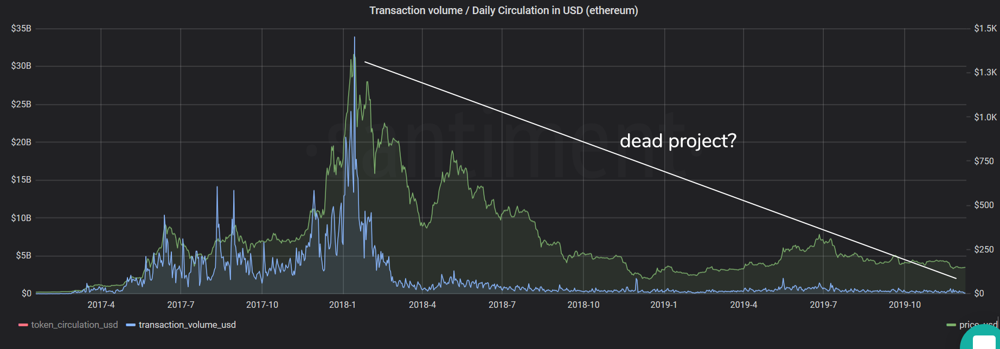

Santiment is an all-in-one market behavior and network intelligence platform for cryptocurrencies. As a trader, our tools can help you identify, contextualize, and eventually - predict market behavior.
All Santiment tools and products serve a singular purpose - to help users understand the behavioral patterns and activities of crucial market stakeholders.

Instead of relying on pricing data, which is notoriously prone to manipulation in crypto, our indicators and custom trading strategies leverage on-chain data, as well as custom social and development information collected and processed by Santiment. This also means that many of our metrics are entirely custom-built and unavailable anywhere else.

You can find out more about our data feeds on [SanAPI page](http://neuro.santiment.net).

## Use cases

As a general overview, Santiment tools can enhance and complement your trading in several principal ways:

## Spot tops and exit opportunities

A number of our metrics have proven highly effective in signalling forming tops and impending corrections. Here’s just a few examples:

-> Using our social data, we found that extreme spikes in a coin’s social volume during a rally are often a reliable indicator of local tops. This is especially the case with mid and low-cap coins, who mostly ever attract ‘mainstream’ crypto attention during breakouts, so the increased social chatter is almost always pump-related.

On Sanbase, you can subscribe to alerts whenever a coin you’re interested in experiences a surge in social volume, signaling a correction.

Our [Social Trends tool](https://app.santiment.net/labs/trends) lets you view any coin’s social volume over time to prove the effectiveness of this approach.

Example: MATIC

Example: NEO

Example: Tezos

-> Another custom Santiment metric - **Mean Dollar Invested Age** - has been a reliable top indicator for Bitcoin over its entire lifespan.

Mean dollar invested age calculates how long each Bitcoin has stayed in its current address, and then computes the average ‘age’ of all money (expressed in dollars) used to buy Bitcoins. In other words, a rising slope on the MDIA chart indicates hodler accumulation, while dips indicate sudden movements of previously idle coins.

Every major Bitcoin top so far was accompanied by a significant drop in mean dollar age:

There are dozens of examples of different Santiment metrics being able to predict tops. Check out the ‘Metrics’ tab on the Academy’s homepage for more use cases and metric tutorials.

## Spot bottoms and entry opportunities

While still relatively sparse compared to our top indicators, we have also started building out our repository of reliable bottom indicators and entry point signals.

Like the above, many of these are exclusive to Santiment and are a result of rigorous backtesting and analysis by our data science team. For instance:

-> The MVRV Long/Short Divergence is a custom indicator built atop the MVRV ratio, a popular metric that calculates the average profit or loss across all coin holders.

In short, the MVRV Long/Short Divergence calculates the difference in the MVRV ratio of longtime holders and the MVRV ratio of ‘new money’ to identify potential deviations. You can read more on the exact methodology here.

Historically, whenever the Long/Short Divergence line crossed 0, it indicated an end of a bear cycle for Bitcoin and jumpstarted the next bull cycle. The last time this indicator crossed 0 was on May 7th 2019 when Bitcoin was around $5830. Within a week, it broke $8000:

-> We have recently developed another novel bottom indicator while examining the divergences in price and on-chain activity, namely daily active addresses (DAA for short)

You can read the full methodology [in our insight](https://insights.santiment.net/read/price---daily-addresses-divergence%3A-%0Aa-primer-on-on-chain-trading-strategies-2222). In short, at times when the asset’s price trended downwards while the amount of DAA shifted in the opposite direction (above a certain angle/threshold), this divergence has often presented very effective entry points for Bitcoin, Ethereum and other crypto assets in the past. The opposite trend also proved a potent top indicator on many occasions:

This strategy is currently being integrated into Sanbase - in the meantime, if you’d like access to future Price-DAA Divergence signals, you can email us at team@santiment.net for more information.

## Identify and monitor volatility markers

Not all metrics need to tell you if the price is likely to go ↑ or ↓ in order to be effective. Several of our on-chain and social indicators also serve to alert you of major behavioral shifts or trend reversals among market participants.

For example, our Token Age Consumed metric tracks the activity of coins based on how long they’ve stayed in their current wallets. Spikes on the TAC chart indicate the movement of previously idle coins, i.e. those owned by longterm HODLers or even ICO investors.

Depending on general market conditions, this holder behavior can mean different things, but it’s  almost always an omen of growing instability.

For instance, we recently wrote about elevated activity on Bitcoin’s Token Age Consumed graph, suggesting that longtime HODLers are starting to move their coins and warning of volatility ahead:

At the time of writing, Bitcoin was in a week-long consolidation mode and trading in the $8300-$8500 range. Within days of the article, Bitcoin first dropped more than % down to $7475, only to then grow by 28.6% in 24 hours, finally slowing down at $9650.

Volatility markers are used most effectively as an initial indicator of upcoming trend reversals, a starting point that you can build upon and leverage by analyzing additional metrics, signals and information.

## Study and contextualize market activity

Finally, Santiment tools do a lot more than inform you of - and enable you to react to - prospective exit and entry points, or help you trade market anomalies. Many of our metrics and indicators warrant deep analysis and close study if you truly want to understand crypto market behavior, network activity or crowd sentiment.

For example, if you looked at pure on-chain transaction volumes for Ethereum over its lifsepan, you’d be forgiven if you assumed that the network suffered mass exodus since its 2018 top, and is currently a shell of its former self:

This is why deep network analysis is so important for successful traders. Compare the above graph with our Token Velocity chart for Ethereum, which measures how often each token is used in daily transactions:

Higher token velocity means that the same token is used in transactions more often. You can notice the same steep drop-off in ETH’s velocity around the start of 2018. This heightened activity (and subsequent dip) correlates strongly with the huge [ETH mixer](https://nulltx.com/over-68-of-all-ethereum-transaction-value-is-mixed-by-one-entity/) that operated between March 2017-2018, artificially inflation on-chain trx volumes by moving the same coins many times over.

Once the mixer was liquidated, token velocity toppled back to ‘normal’ levels (as tokens weren’t mixed as much anymore), where it’s remained ever since. This lets us know that the decline in trx volume wasn’t due to speculative, but rather technical reasons, allowing us to better understand - and valuate the network.

Speaking of valuation metrics, Santiment offers a number of highly effective long-term indicators of project health. These will not tell you where the price is headed short-term, but it will give you a strong sense of the project’s well-being, adoption and ongoing development - all crucial longterm investment factors.

For example, network growth (number of new addresses created on the network daily) is a strong on-chain proxy for project adoption over time. Compare the network growth of a project with strong community backing like BAT, which continues to add hundreds of new addresses to its network each day:

To a wasteland that is hundreds of failed altcoins, whose only real on-chain activity occurred around the ICO days, and has since fallen to oblivion:

Which project are you more likely to invest in?
