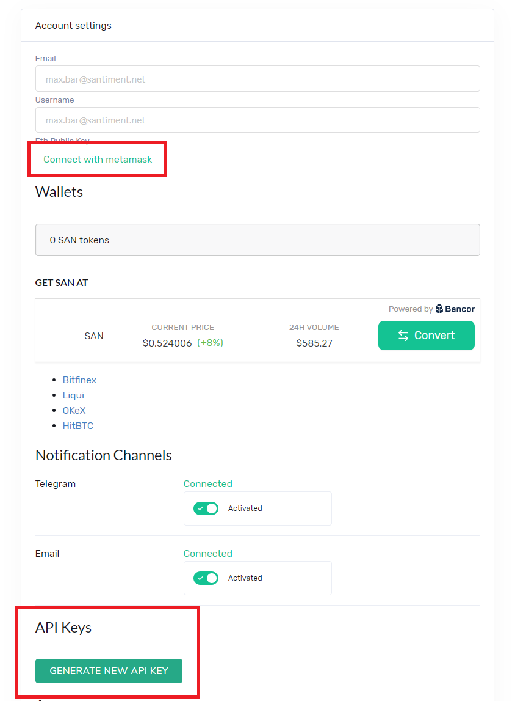

All of our current products use the [SANbase](https://app.santiment.net)
account as reference. SANgraphs lets you directly use SANbase as a login
option, but this does not work for the API or for SANsheets. This is
where an API key comes in.\
\
When you have SAN tokens staked in your SANbase account (find out how to
do this
[here](/intercom-articles/getting-started/san-tokens-and-metamask/how-to-stake-san))
you are able to create an API key that carries the same access rights,
to use with these other products. You can create an API key without any
stake, but it will not do its job yet.

Adding an API key on SANbase {#adding-an-api-key-on-sanbase .intercom-align-left data-post-processed="true"}
----------------------------

Adding API keys is done in the account settings of SANbase. You can find
them by hovering over the small account icon in the upper right corner:

::: {.intercom-container .intercom-align-left}

:::

In accounts settings you will find two relevant options for the API key:

::: {.intercom-container .intercom-align-left}

:::

The first is shown while you have not connected an Ethereum address yet
(so you have no tokens staked as far as we know). Click here to connect
a wallet using MetaMask, learn more by reading the article linked to at
the top.

The second lets you add the actual API key. Click **\'GENERATE NEW API
KEY\'**. You can now see that an API key has been created:

::: {.intercom-container .intercom-align-left}

:::

As you can see, it can be revoked from here anytime.

To use the API key, click on the eye-icon to show the actual key. You
can now copy it and use it elsewhere.
