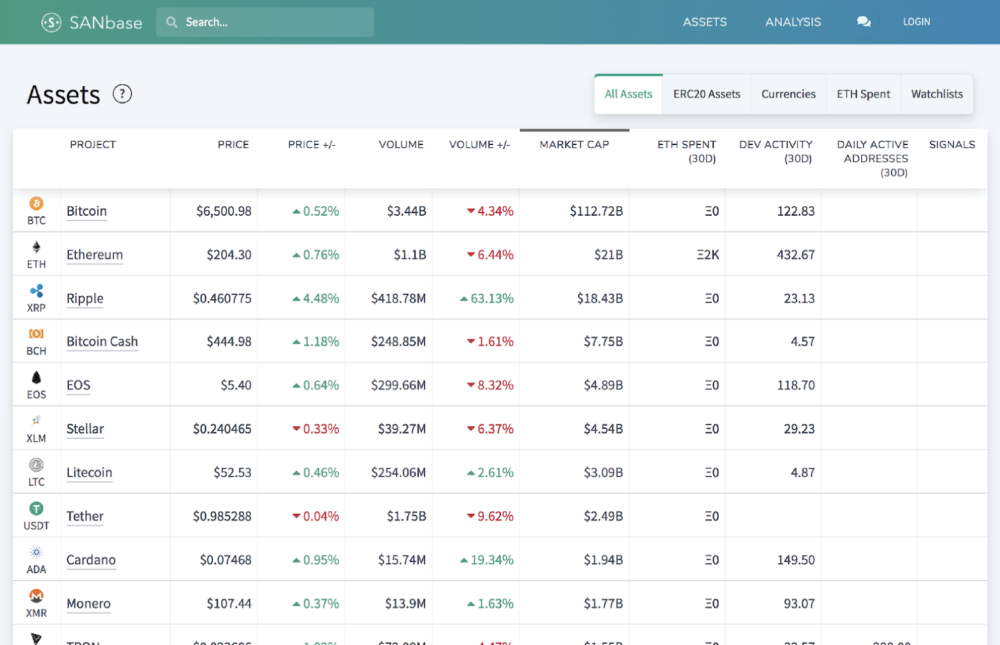
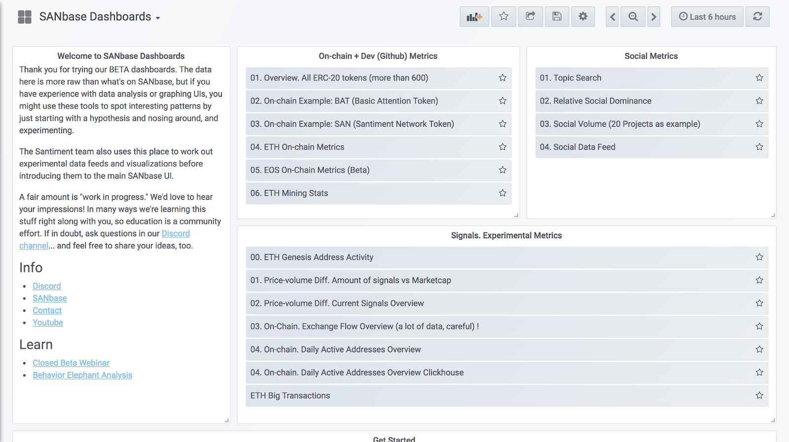
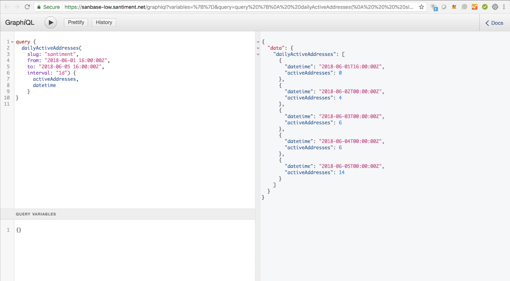

## Sanbase

Sanbase is our main blockchain-enabled web app, which is also accessible
on mobile. It provides financial, development, on-chain and
social/sentiment data for the general crypto market plus more than 1500
crypto assets across a growing number of blockchains.

Much of the data is available anonymously, for free. Get more in-depth
features with a simple email login.

<https://app.santiment.net>

## Sangraphs

Sangraphs (formerly "Sanbase Dashboards") is our beta test area, where
we have experimental features and work out new datafeeds before
introducing them to Sanbase. This area is accessible via SAN staking and
is for more advanced users.

<https://data.santiment.net>

## Neuro API

Use it free for 3 months of data, or stake SAN for full historical data
plus real time data feed.

<https://docs.santiment.net>

## Sansheets

Sansheets is a plugin for Google or Excel spreadsheets. Transform
your sheets with select crypto metrics for the past 3 months. You can
find the plugin under the Add-Ons menu (Get Add-Ons > Search for
Santiment).

