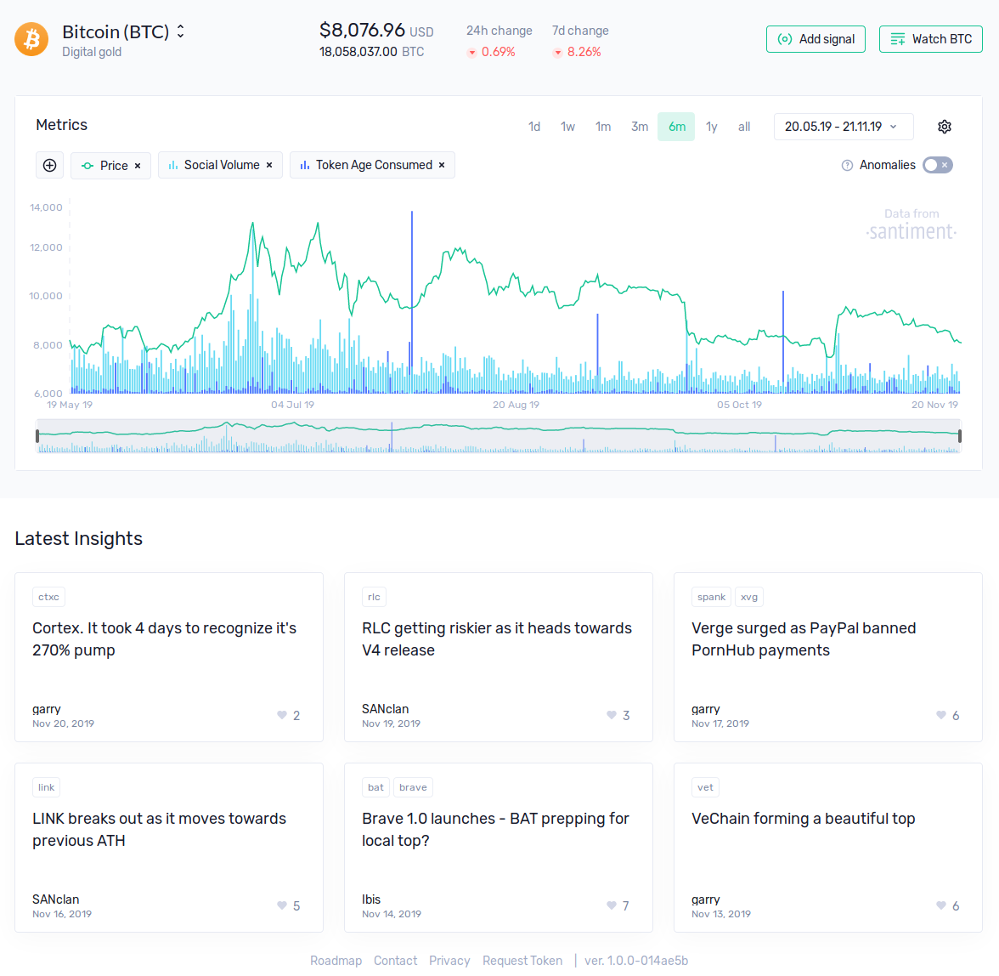
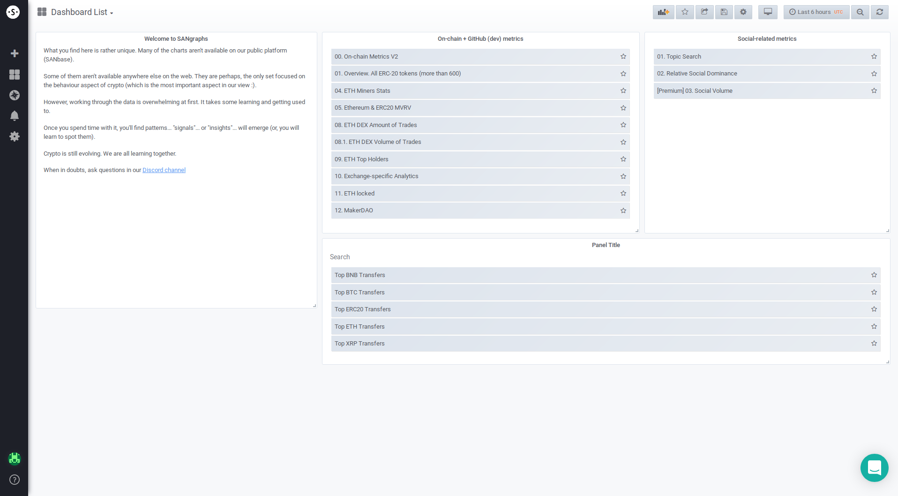
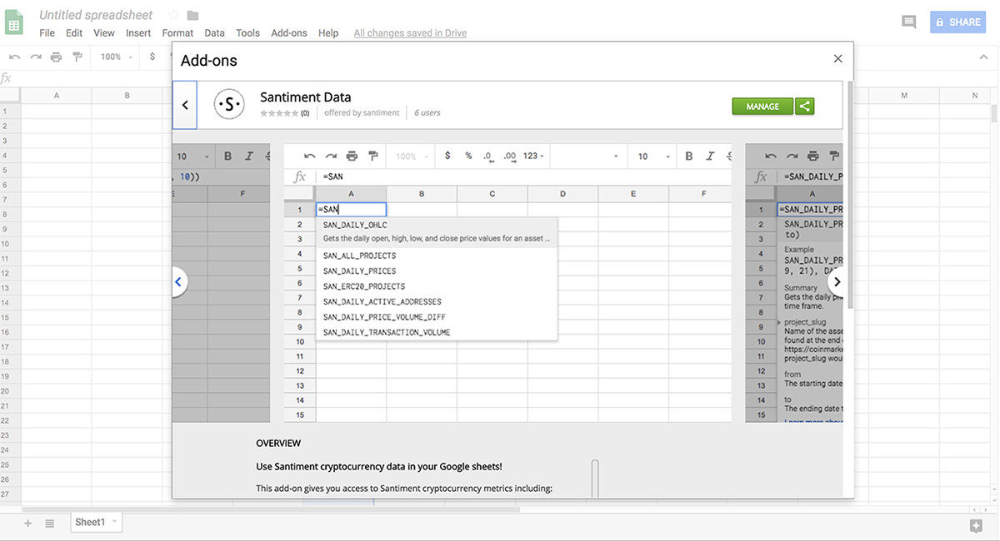
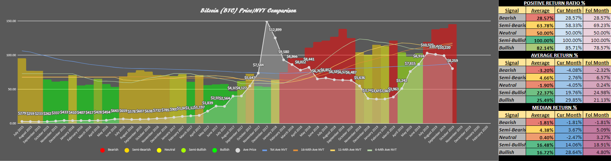

## Sanbase

Sanbase is our main blockchain-enabled web app, which is also accessible
on mobile. It provides financial, development, on-chain and
social/sentiment data for the general crypto market plus more than 1500
crypto assets across a growing number of blockchains.

Much of the data is available anonymously, for free. Get more in-depth
features with a simple email login.

<https://app.santiment.net>

## Sandata

Sandata (formerly "Sangraphs") is our beta test area, where
we have experimental features and work out new datafeeds before
introducing them to Sanbase. This product is for more advanced users.

<https://data.santiment.net>

## SanAPI

SanAPI is the GraphQL API which powers Sanbase. Together with the API
we offer a Python library [Sanpy](https://github.com/santiment/sanpy)
which offers easy access to the data for data scientists knowledgable
in Python.

<https://neuro.santiment.net>

## Sansheets

Sansheets is a Google Sheets plugin that gives access to our data using
simple functions directly from your spreadsheet.

<https://sheets.santiment.net/>

