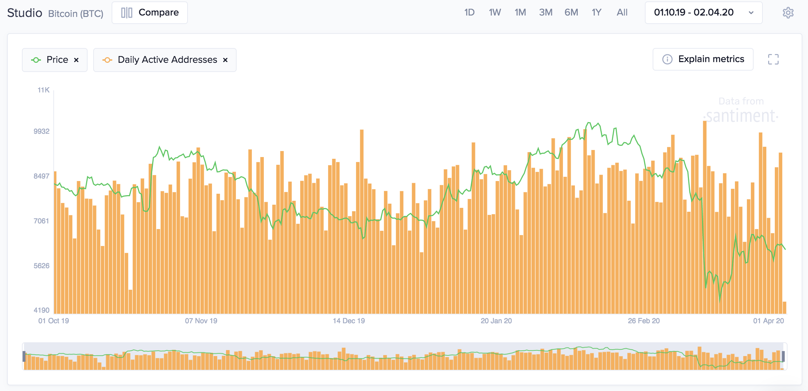

## Definition

The number of distinct addresses that participated in a transfer for the given
asset in any given day. Each address is counted only once for the day, regardless of the amount of transfers it participates in. Both the
senders and the receivers of the asset are counted.



## Access

[Free Access](/metrics/details/access#free-access)

---

## Measuring Unit

Non-negative number of addresses

---

## Data Type

[Timeseries Data](/metrics/details/data-type#timeseries-data)

---

## Frequency

[Daily Intervals](/metrics/details/frequency#daily-frequency)

---

## Latency

[On-Chain Latency](/metrics/details/latency#on-chain-latency)

---

## Available Assets

Available for [these
assets](<https://api.santiment.net/graphiql?variables=&query=%7B%0A%20%20getMetric(metric%3A%20%22daily_active_addresses%22)%20%7B%0A%20%20%20%20metadata%20%7B%0A%20%20%20%20%20%20availableSlugs%0A%20%20%20%20%7D%0A%20%20%7D%0A%7D%0A>)

---

## API

Available under the `daily_active_addresses` name.

```graphql explorer
{
  getMetric(metric: "daily_active_addresses") {
    timeseriesDataJson(
      slug: "santiment"
      from: "2020-01-01T00:00:00Z"
      to: "2020-01-07T00:00:00Z"
      interval: "1d"
    )
  }
}
```
