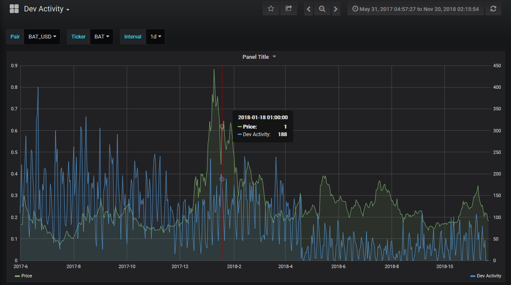

A developer's time is a relatively expensive resource (especially in
crypto), so high dev activity implies that:

1.  The project is serious about its business proposition
2.  The project will likely ship new features in the future
3.  It's less likely that the project is just an exit scam

Simply put, Developer Activity can be used to gauge a project's
commitment to creating a working product, and continuously polishing and
upgrading its features.



*Dev Activity graph for Basic Attention Token*

## Measure

We measure dev activity differently than most.

Most data aggregators track the number of Github commits, an unfortunate
solution that returns skewed data.

At Santiment, we implemented a more reliable approach -- tracking the
number of Github events that the project generates. Our custom method
dramatically improves both accuracy and serviceability of Github data.

If you want to learn more about the difference - and the benefits of our
bespoke approach - I highly suggest [this
piece](https://medium.com/santiment/tracking-github-activity-of-crypto-projects-introducing-a-better-approach-9fb1af3f1c32)
by Valentin, our CTO.


## As a Trading Strategy

While not common, Dev Activity can also be used as a novel trading
strategy. A few months back, we tested a portfolio of only the top ERC20
projects by dev activity, refreshed each month.

We backtested the strategy from August 2017 to October 2018. [The
portfolio 1](https://santiment.net/blog/github-activity-portfolio/)
turned a profit, but didn't beat hodling BTC overall.


However, our portfolio was also more volatile than hodling over time,
registering significantly larger tops in January and May of 2018. If you
were to sell at one of those intersections instead, our Github portfolio
would in fact be the winner.

As a custom metric, dev activity can help you understand a project's
dedication to its product, and in turn - its end users.


[**Run in
explorer**](https://api.santiment.net/graphiql?variables=%7B%7D&query=query%7BdevActivity(from%3A%20%222019-08-23T21%3A00%3A00.000Z%22%2C%20to%3A%20%222019-08-25T21%3A00%3A00.000Z%22%2Cinterval%3A%221d%22%2Cslug%3A%22santiment%22)%7Bactivity%2Cdatetime%7D%7D)

```js
{
  devActivity(from: "2019-05-12T09:45:27.283Z", interval: "1d", slug: "santiment", to: "2019-06-11T09:45:30.487053Z") {
    activity
    datetime
  }
}
```

**Run in terminal**

```sh
curl \
  -X POST \
  -H "Content-Type: application/json" \
  --data '{ "query": "query{devActivity(from:\"2019-05-12T09:45:27.283Z\",interval:\"1d\",slug:\"santiment\",to:\"2019-06-11T09:45:30.487053Z\"){activity,datetime}}" }' \
  https://api.santiment.net/graphql
```
