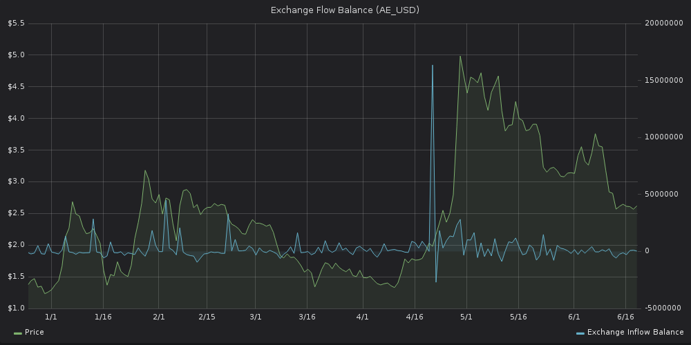

## Exchange Flow

The Exchange Flow graph shows the amount of inflow and outflow plotted
separately.


Red spikes show tokens exiting exchange wallets; blue spikes show them
moving in.

## Exchange Flow Balance

Exchange Flow Balance shows the combined values of tokens moving in and
out of exchange wallets on a certain date.

If the value is positive on said date, more of a particular token
entered the exchanges than left, and vice versa.

It's not uncommon for large inflows of tokens to the exchange to precede
rapid price growth.

Here's that exact scenario in case of
[aeternity](https://aeternity.com/), a blockchain platform that enables
scalable smart contracts:



When a large amount of tokens flow out of the exchange, on the other
hand, the price is likely to fall soon thereafter.

The below graph shows lots of [DICE](https://etheroll.com/) tokens moving
out of exchange wallets during a price rally; the price plunged
following the event.


## Exchange Funds Flow

Fetch the flow of funds into and out of known exchange wallets. This
query returns the difference IN-OUT calculated for each interval.

[**Run in
explorer**](<https://api.santiment.net/graphiql?variables=%7B%7D&query=query%7BexchangeFundsFlow(from%3A%222019-05-12T09%3A45%3A27.283Z%22%2Cinterval%3A%221d%22%2Cslug%3A%22dragonchain%22%2Cto%3A%222019-06-26T09%3A45%3A27.283Z%22)%7Bdatetime%2CinOutDifference%7D%7D>)

```graphql
{
  exchangeFundsFlow(
    from: "2019-05-12T09:45:27.283Z"
    interval: "1d"
    slug: "dragonchain"
    to: "2019-06-26T09:45:27.283Z"
  ) {
    datetime
    inOutDifference
  }
}
```

**Run in terminal**

```sh
curl \
  -X POST \
  -H "Content-Type: application/json" \
  --data '{ "query": "query{exchangeFundsFlow(from:\"2019-05-12T09:45:27.283Z\",interval:\"1d\",slug:\"dragonchain\",to:\"2019-06-26T09:45:27.283Z\"){datetime,inOutDifference}}" }' \
  https://api.santiment.net/graphql
```
