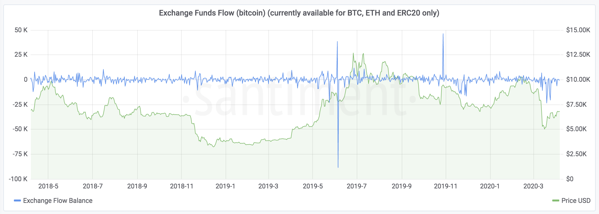

## Definition

There are three separate metrics regarding exchange funds flow:

- `exchange_inflow` - How many coins/tokens are moved from non-exchange to
  exchange wallets.
- `exchange_outflow` - How many coins/tokens are moved from exchange to
  non-exchange wallets.
- `exchange_balance` - The difference inflow-outflow (inflow minus outflow). The
  usefulness of this metric comes from the fact that transactions from
  missing/unknown exchange wallets to missing/unknown exchange wallets cancel
  each other.

Some of the metrics have a USD equivalent - the raw value is multiplied by the
price of the coin/token at the given date. The available USD metrics are
`exchange_inflow_usd` and `exchange_outflow_usd`




---

## Access

[Restricted Access](/metrics/details/access#restricted-access).

---

## Measuring Unit

Amount of coins/tokens

---

## Data Type

[Timeseries Data](/metrics/details/data-type#timeseries-data)

---

## Frequency

**[Five-Minute Intervals](/metrics/details/frequency#five-minute-frequency)
**
---

## Latency

[On-Chain Latency](/metrics/details/latency#on-chain-latency)

---

## Use Case

It's not uncommon for large inflows of tokens to the exchange to precede
rapid price growth.

Here's that exact scenario in case of
[aeternity](https://aeternity.com/), a blockchain platform that enables
scalable smart contracts:


> Note: Aeternity moved from ERC20 to their own blockchain and Santiment does not have data for this new blockchain.

When a large amount of tokens flow out of the exchange, on the other
hand, the price is likely to fall soon thereafter.

---

## Available Assets

Available for [these
assets](<https://api.santiment.net/graphiql?variables=&query=%7B%0A%20%20getMetric(metric%3A%20%22exchange_balanced%22)%20%7B%0A%20%20%20%20metadata%20%7B%0A%20%20%20%20%20%20availableSlugs%0A%20%20%20%20%7D%0A%20%20%7D%0A%7D%0A>)

> Note: All of the metrics are available for the same set of assets.

---

## SanAPI

Available under the `exchange_balance`, `exchange_inflow` and `exchange_outflow` names.

```graphql
{
  getMetric(metric: "exchange_balance") {
    timeseriesData(
      slug: "santiment"
      from: "2020-01-01T12:00:00Z"
      to: "2020-01-03T12:00:00Z"
      interval: "1d"
    ) {
      datetime
      value
    }
  }
}
```

**[Run in
explorer](<https://api.santiment.net/graphiql?variables=&query=%7B%0A%20%20getMetric(metric%3A%20%22exchange_balance%22)%20%7B%0A%20%20%20%20timeseriesData(%0A%20%20%20%20%20%20slug%3A%20%22santiment%22%0A%20%20%20%20%20%20from%3A%20%222020-01-01T12%3A00%3A00Z%22%0A%20%20%20%20%20%20to%3A%20%222020-01-03T12%3A00%3A00Z%22%0A%20%20%20%20%20%20interval%3A%20%221d%22)%20%7B%0A%20%20%20%20%20%20%20%20datetime%0A%20%20%20%20%20%20%20%20value%0A%20%20%20%20%7D%0A%20%20%7D%0A%7D%0A>)**

---

```graphql
{
  getMetric(metric: "exchange_inflow") {
    timeseriesData(
      slug: "santiment"
      from: "2020-01-01T12:00:00Z"
      to: "2020-01-03T12:00:00Z"
      interval: "1d"
    ) {
      datetime
      value
    }
  }
}
```

**[Run in
explorer](<https://api.santiment.net/graphiql?variables=&query=%7B%0A%20%20getMetric(metric%3A%20%22exchange_inflow%22)%20%7B%0A%20%20%20%20timeseriesData(%0A%20%20%20%20%20%20slug%3A%20%22santiment%22%0A%20%20%20%20%20%20from%3A%20%222020-01-01T12%3A00%3A00Z%22%0A%20%20%20%20%20%20to%3A%20%222020-01-03T12%3A00%3A00Z%22%0A%20%20%20%20%20%20interval%3A%20%221d%22)%20%7B%0A%20%20%20%20%20%20%20%20datetime%0A%20%20%20%20%20%20%20%20value%0A%20%20%20%20%7D%0A%20%20%7D%0A%7D%0A>)**

---

```graphql
{
  getMetric(metric: "exchange_outflow") {
    timeseriesData(
      slug: "santiment"
      from: "2020-01-01T12:00:00Z"
      to: "2020-01-03T12:00:00Z"
      interval: "1d"
    ) {
      datetime
      value
    }
  }
}
```

**[Run in
explorer](<https://api.santiment.net/graphiql?variables=&query=%7B%0A%20%20getMetric(metric%3A%20%22exchange_outflow%22)%20%7B%0A%20%20%20%20timeseriesData(%0A%20%20%20%20%20%20slug%3A%20%22santiment%22%0A%20%20%20%20%20%20from%3A%20%222020-01-01T12%3A00%3A00Z%22%0A%20%20%20%20%20%20to%3A%20%222020-01-03T12%3A00%3A00Z%22%0A%20%20%20%20%20%20interval%3A%20%221d%22)%20%7B%0A%20%20%20%20%20%20%20%20datetime%0A%20%20%20%20%20%20%20%20value%0A%20%20%20%20%7D%0A%20%20%7D%0A%7D%0A>)**
