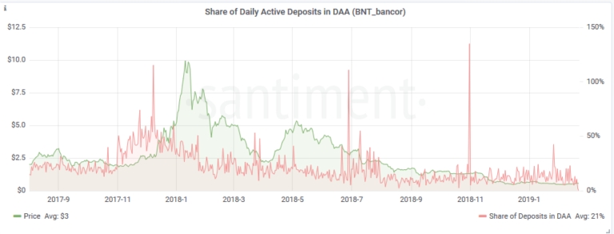

## Daily Active Deposits

Shows the **number of unique deposit
addresses** that have been active on a particular day.

As an example, let's look at the DAD metric for REP, Augur's native
coin. REP's price is in green, while Daily Active Deposits are colored
blue.

[](https://santiment.net/wp-content/uploads/2019/02/dad-augur-2.png)

The first thing we can see is a more-less stable DAD spread over the
past 6 month. On average, 43 deposit addresses were active on the Augur
network each day.

Compared to other ERC-20 tokens, that's not a bad tally. For example,
over the same time period, SONM recorded an average of 10 DAD, while SNT
(Status) had 27, despite it being one of the most actively developed
ERC-20 projects.

In contrast, OMG -- one of the most active tokens on the Ethereum
network -- boasts an average of 110 DAD.

### SanAPI

This metric is calculated daily, so the interval should represent whole
days.

Grouping by interval works by taking the mean of all daily results the
interval.

[**Run in
explorer**](https://api.santiment.net/graphiql?query=%7B%0A%20%20dailyActiveDeposits(from%3A%20%222019-05-09T11%3A25%3A04.894Z%22%2C%20interval%3A%20%221d%22%2C%20slug%3A%20%22maker%22%2C%20to%3A%20%222019-06-23T11%3A25%3A04.894Z%22)%20%7B%0A%20%20%20%20activeDeposits%0A%20%20%20%20datetime%0A%20%20%7D%0A%7D%0A&variables=)

```js
{
  dailyActiveDeposits(from: "2019-05-09T11:25:04.894Z", interval: "1d", slug: "maker", to: "2019-06-23T11:25:04.894Z") {
    activeDeposits
    datetime
  }
}
```

**Run in terminal**

```sh
curl \
  -X POST \
  -H "Content-Type: application/json" \
  --data '{ "query": "query{dailyActiveDeposits(from:\"2019-05-09T11:25:04.894Z\",interval:\"1d\",slug:\"maker\",to:\"2019-06-23T11:25:04.894Z\"){activeDeposits,datetime}}" }' \
  https://api.santiment.net/graphql
```


## Share of Daily Active Deposits in Total Daily Active Addresses
Built on top of DAD, SDD calculates the share of daily active deposits
(DAD) in the total number of daily active addresses (DAA), by dividing
the two (DAD/DAA). The results are shown in percentages for simplicity.

[](https://santiment.net/wp-content/uploads/2019/02/augur.png)

The idea behind this metric is to serve as a quick-glance **indicator of
the speculative interest** in a particular coin. The bigger the SDD, the
more people are using the coin for trading rather than whatever its
proposed utility, and vice versa.

It's worth keeping in mind, however, that SDD does not give us the
**full picture** in terms of an absolute speculative interest on a
network. For example, an SDD of 20% does not mean that **only 20%** of
the network activity on a given day is trade-related.

Our DAA metric, which tracks a **total number** of Daily Active
Addresses, consists of several types of addresses interacting with a
network daily:

1.  Deposit Addresses
2.  Main Exchange wallets
3.  Withdrawal Addresses
4.  Addresses that are actually using the coins for its utility

Obviously, 3 out of 4 of these (types of) addresses are trade related.
SDD, by itself, accounts only for the share of **Deposit Addresses** in
total Daily Active Addresses.

The number of main exchange wallets is more-less constant and almost
entirely inconsequential compared to the number of deposit and
withdrawal addresses.

However, when using SDD to gauge the relative speculative interest in a
coin, keep in mind that withdrawal addresses are **not** included in the
calculation, so the actual % of trade-related network activity will
usually be even higher.

That said, a spike in SDD will still undoubtedly indicate that the
speculative activity on the network is growing. On the other hand, a
drop in SDD may suggest **network maturation**, as less people use the
coin for trading and turn to its (other) purported benefits.

Compared to DAD, which can be used to examine and explain momentary
market events, Share of Daily Active Deposits is designed as more of a
long-term indicator. So far, we found it to be much more useful for a
wall-to-wall retrospective or comparative analysis.

### Examples

Let's compare the SDD for a couple of different projects:

1. 0x (ZRX)
	[](https://santiment.net/wp-content/uploads/2019/02/zrx.png)
2. Bancor (BNT)
	[](https://santiment.net/wp-content/uploads/2019/02/bancor-1.png)

Save for a few notable spikes, 0x has exhibited a relatively stable
share of Daily Active Deposits in DAA for the last 18 months. On
average, the network's SDD stands at 15.5% for the observed time frame.

Bancor's SDD, on the other hand, is a fair bit more volatile, ranging
from an average of 20% at the end of 2017 to just ~5% for the last 30
days. This tells us that the coin's being traded less than it used to
be, at least **relative** to the number of total daily active addresses
on the network.

This should be good news for the project, as the decline in relative
speculative interest indicates a growing maturity of the network:
nowadays, Bancor seems to be used more often for its primary (utility)
purpose.


## Deposit-related Transactions

Shows the total number of all **incoming
and outcoming transactions** involving deposit addresses on a particular
day.

As such, this metric accounts for both user-to-exchange transactions:

1.  from a personal wallet to a deposit address, and
2.  from a deposit address to the main exchange wallet.

Deposit-related Transactions is often valuable when used in conjunction
with **Exchange Inflow** -- [another one of our
metrics](/sandata/metrics/exchange-flow)
-- which shows the total amount of coins moving to exchange wallets on a
particular day.

So, for example, an **increase in exchange inflow** but a **plateauing
number of deposit-related transactions** means that more coins are
entering the exchanges, although the number of transactions to the
exchanges stayed the same. In other words, **the average deposit size
has increased.**

As another use-case of this metric, let's take a look what
Deposit-related Transactions can tell us about MKR's popularity over
time:

[](https://santiment.net/wp-content/uploads/2019/02/maker.png)

The Transaction graph clearly shows a steady increase in the total
number of deposit-related transactions -- **especially** in the past few
weeks. In other words, the speculative interest in Maker seems to be
blooming.

It's also noteworthy that the Transaction Number metric really started
breaking out in Autumn, coinciding with Maker's surge in popularity.

## Share of Deposit-related Transactions on Total Transactions

The SDT metric shows the share of deposit-related transactions in the
total number of transactions on a network.

The main goal remains to measure the level of speculative interest in a
coin -- but from another perspective.

**SDT** is particularly useful when combined with **Daily Active
Deposits** and their **share in total daily active addresses (SDD).**

For example, it could be the case that a relatively small number of
deposit addresses generates a **disproportionately large**amount of
transactions on the network. Or vice versa -- a large number of deposit
addresses generate a relatively small amount of network transactions,
indicating that a token is used predominantly for its utility.

The former seems to be the case with REP. If we look at Augur over the
last 6 months, we'd find just **30% of deposit addresses** (on average)
responsible for **50% of all network transactions:**

[](https://santiment.net/wp-content/uploads/2019/02/SAD-augur.png)

*Share of daily active deposits in DAA over the last 6 months (SDD)
=30%*

[](https://santiment.net/wp-content/uploads/2019/02/sdt.png)

*Share of Deposit-related transactions over the last 6 months = 50%*

We see another peculiar case in the case of OmiseGo, where the number of
daily active deposits over the last 6 months stayed the same, but the
share of deposit-related transactions significantly increased. This
means that non-deposit addresses now account for comparatively less
transactions, which may indicate a **steady rise of speculative
interest** in the OMG network:

[](https://santiment.net/wp-content/uploads/2019/02/dad-omg.png)

*A steady number of Daily Active Deposits over the last 6 months (minus
that huge spike)*

[](https://santiment.net/wp-content/uploads/2019/02/sdt-omg.png)

*A gradual increase in share of deposit-related transactions over the
last 6 months*
