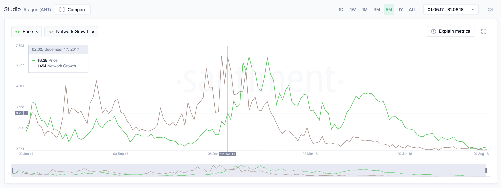

<iframe width="560" height="315" src="https://www.youtube.com/embed/TRcUAhmOUpY?si=5iAn2-kAggN_Z1S6" title="YouTube video player" frameborder="0" allow="accelerometer; autoplay; clipboard-write; encrypted-media; gyroscope; picture-in-picture; web-share" referrerpolicy="strict-origin-when-cross-origin" allowfullscreen></iframe>

## Definition

The amount of new addresses that transferred a given token for the first
time.

This chart illustrates user adoption over time and can be used to
identify when the project is gaining or losing traction.



Here's a Network Growth graph for
[Aragon](https://app.santiment.net/projects/aragon), which lets anyone create
and manage a decentralized organization on Ethereum.

UP until December of 2017, the Aragon network grew by 85-750 new addresses each
day, and the price loyally followed.

Then, right around the start of 2018, the network growth slowly began to
throttle. It indicated that the Aragon user base was already quite deep, and
wouldn't be able to sustain future price growth.

What happened since speaks for itself.

---

## Access

[Restricted Access](/metrics/details/access#restricted-access)

---

## Measuring Unit

Number of addresses

---

## Data Type

[Timeseries Data](/metrics/details/data-type#timeseries-data)

---

## Change Metrics

[Change Metrics](/metrics/details/change_metrics)

---

## Frequency

[Daily Intervals](/metrics/details/frequency#daily-frequency)

---

## Latency

[On-Chain Latency](/metrics/details/latency#on-chain-latency)

---

## Available Assets

Available for [these
assets](<https://api.santiment.net/graphiql?variables=&query=%7B%0A%20%20getMetric(metric%3A%20%22network_growth%22)%20%7B%0A%20%20%20%20metadata%20%7B%0A%20%20%20%20%20%20availableSlugs%0A%20%20%20%20%7D%0A%20%20%7D%0A%7D%0A>)

---

## SanAPI

Available under the `network_growth` name.

```graphql explorer
{
  getMetric(metric: "network_growth") {
    timeseriesDataJson(
      slug: "santiment"
      from: "2019-01-01T00:00:00Z"
      to: "2019-09-01T00:00:00Z"
      interval: "7d"
    )
  }
}
```

## Full list of metrics

The full list of Network Growth metrics is:

<details>

<summary>Open Metrics List</summary>

- network_growth
- network_growth_change_1d
- network_growth_change_30d
- network_growth_change_7d

</details>

