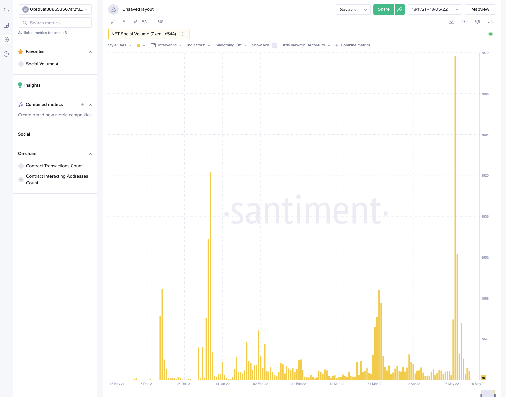

## Definition

Social Volume is build on top of the [Social Data](/metrics/details/social-data).
The idea is pretty much the same as for [Social Volume](/metrics/social-volume).

The total number of [text documents](/metrics/details/text-document) that
contain the mention of certain NFT Collection at least one. Examples of documents are telegram
messages and reddit posts. E.g., if a single short telegram message includes the word
`bored ape` more than once, this message will increase the social volume of the
Bored Ape Yacht Club by 1. If a long reddit post contains the word `bored ape` 10 times,
this again will increase the social volume of the Bored Ape Yacht Club by 1.

Social Volume computed for NFT contract. For each contract we construct a special search term.
We use machine learning model based on TF-IDF for computing those search terms. The idea is that we try to compute search terms based on pairwise similarity of NFTs' names. For computing embedding per each collections' name we use TF-IDF model on n-grams of chars.

Some search terms examples for some NFT collections:
- [CryptoPunks](https://www.larvalabs.com/cryptopunks) - `cryptopunks`;
- [Veefriends Series 2](https://series2.veefriends.com/) - `veefriends`;
- [CyberKongz VX](https://www.cyberkongz.com/) - `cyberkongz`.

---

Please note that metrics may undergo changes in historical values due to automated recalculations triggered monthly. We constantly update our labels which helps us to keep labels as fresh as possible but result historical data changes. Any modifications to labels, social sources, or relevant jobs will prompt recalculation for the previous month's data. Additionally, adjustments to labels automatically trigger recalculation of labeled balances.

## Access

[Restricted Access](/metrics/details/access#restricted-access).

---

## Measuring Unit

Amount of documents that mention the given NFT Collection.

---

## Data Type

[Timeseries Data](/metrics/details/data-type#timeseries-data)

---

## Change Metrics

[Change Metrics](/metrics/details/change_metrics)

---

## Frequency

[Five-Minute Intervals](/metrics/details/frequency#five-minute-frequency)

---

## Latency

[Social Data Latency](/metrics/details/latency#social-data-latency)

---

## Sanbase

NFT Social Volume from all sources for a spicific NFT contract can be seen on a [charts
page](https://app.santiment.net/s/W4uf9CWx).

The combined social volume from all sources is displayed. 

## SanAPI

Available under the `nft_social_volume` name, where the value is combined from all sources (telegram, reddit, twitter, bitcointalk).

### Social Volume for [Azuki](https://www.azuki.com/gallery)

```graphql
{
  getMetric(metric: "nft_social_volume") {
    timeseriesData(
      selector: {contractAddress:"0xed5af388653567af2f388e6224dc7c4b3241c544"}
      from: "2022-01-01T00:00:00Z"
      to: "2022-03-07T00:00:00Z"
      interval: "1d"
    ) {
      datetime
      value
    }
  }
}
```

**[Run in
Explorer](<https://api.santiment.net/graphiql?query=%7B%0A%20%20getMetric(metric%3A%20%22nft_social_volume%22)%20%7B%0A%20%20%20%20timeseriesData(%0A%20%20%20%20%20%20selector%3A%20%7BcontractAddress%3A%220xed5af388653567af2f388e6224dc7c4b3241c544%22%7D%0A%20%20%20%20%20%20from%3A%20%222022-01-01T00%3A00%3A00Z%22%0A%20%20%20%20%20%20to%3A%20%222022-03-07T00%3A00%3A00Z%22%0A%20%20%20%20%20%20interval%3A%20%221d%22%0A%20%20%20%20)%20%7B%0A%20%20%20%20%20%20datetime%0A%20%20%20%20%20%20value%0A%20%20%20%20%7D%0A%20%20%7D%0A%7D>)**
