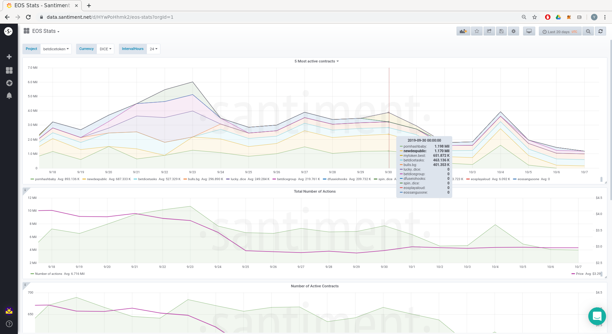
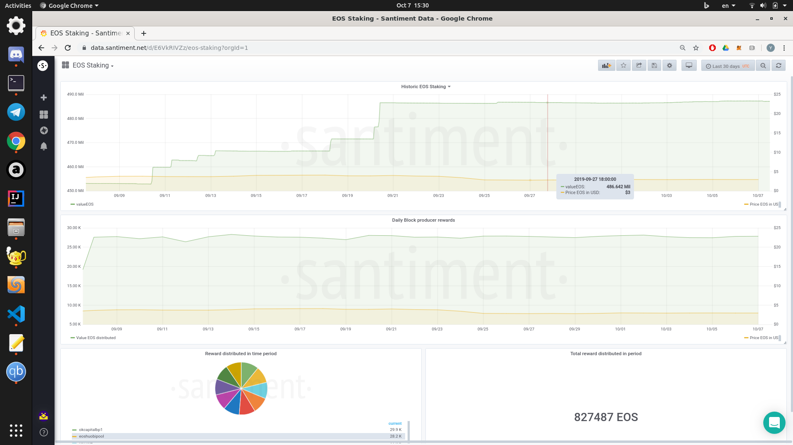
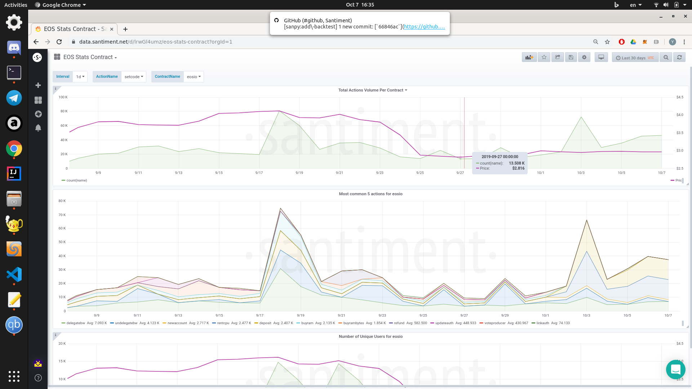
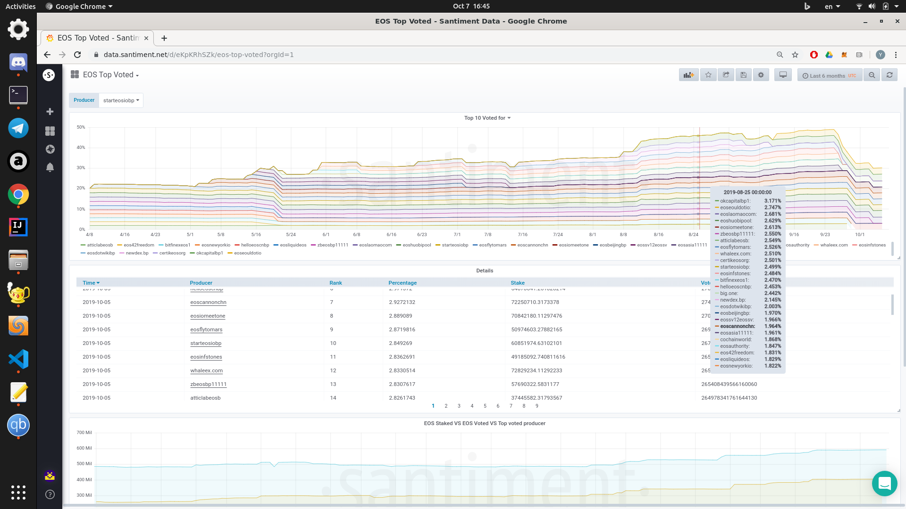

# EOS on-chain metrics

Those are multiple EOS on-chain metrics available through Dashboards. To access them visit:

https://data.santiment.net

## EOS stats

Some generic statistics. They are currently slow to load if a huge interval is used.

### Five most active contracts

The number of actions on the five most active EOS contracts. All types of actions, including internal ones are counted.

### Total number of actions

The total number of actions on the blockchain. Can be used as a metric for overall activity.

### Number of active contracts

The number of contracts on which there has been any activity for a time period. The time period can be changed through *IntervalHours* variable.

### Transaction volume of Currency

The transaction volume of a currency on a contract for a time period. The three variables are considered *Project*, *Currency* and *IntervalHours*. Calculates the sum of the volume transferred for the specified currency for the specified time period.

### Active addresses of Currency

The number of unique users transferring a currency for a time period. The three variables are considered *Project*, *Currency* and *IntervalHours*.

## EOS health stats

Some statistics which can be interpreted as how well the EOS blockchain is being adopted.

Note: Currently too slow for larger time intervals.

### Number unique voters

The number of unique users who have voted for a time interval *Interval*

### Number unique contracts deployed

The number of contract deployments for a time interval *Interval*

### Historic spending on EOS Ram

Amount of EOS spent for buying the EOS Ram resource through time.

## EOS Staking

Metrics related to the staking and voting.

### Historic EOS Staking

Amount of EOS being staked through time.

### Daily block producers rewards

Amount in EOS earned by block producers per day.

### Reward distributed in time period

Pie chart showing reward distributed to top block producers.

### Total reward distributed in period

Total EOS being rewarded to block producers for the time period of the dashboard.

## EOS Balances

A tool to monitor the historic balance of an address in a specific EOS currency.

## EOS Stats contract

### Total actions volume per contract

The number of actions happening for *Interval* for contract *ContractName*.

### Most common five actions for *ContractName*

The five most common actions for the specified contract.

### Number of active users for *ContractName*

The number of active users of the specified contract for the specified *Interval*.

## EOS Top Holders

Dashboard showing the Top holders for the selected EOS currency.

## EOS Top Voted

### Top 10 Voted for

The top 10 voted for producers through time. In the *Details* table a list of the first hundred can be seen along with details.

### EOS Staked vs EOS Voted vs Top voted producer

A graphic comparing all the staked EOS vs all EOS voted with and also all the EOS received by the top voted producer.

### Top voters per producer

For the selected producer *Producer* show the top voters ordered by their vote weight.
