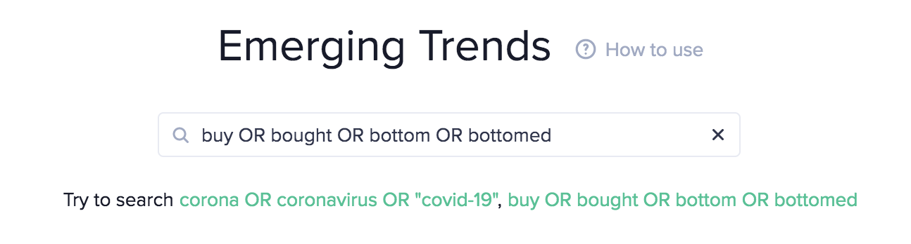

## Definition

Social Dominance is build on top of the [Social Data](/metrics/details/social-data).

Social Dominance for an asset compares the [Social
Volume](/metrics/social-volume) of that asset to the combined social volume of the
100 largest market cap assets.

Social Dominance for arbitrary search term compares the [Social
Volume](/metrics/social-volume) of that search term to the total number of
documents available. This essentially counts how many percent of all documents
match this search term.

Social Dominance of 50 for an asset means that half of all messages/posts regarding
assets are discussing exactly this asset.

## Access

[Restricted Access](/metrics/details/access#restricted-access).

---

## Measuring Unit

% between 0 and 100.

---

## Data Type

[Timeseries Data](/metrics/details/data-type#timeseries-data)

---

## Frequency

[Five-Minute Intervals](/metrics/details/frequency#five-minute-frequency)

---

## Latency

[Social Data Latency](/metrics/details/latency#social-data-latency)

---

## Available Assets

Available for [these
assets](<https://api.santiment.net/graphiql?variables=&query=%7B%0A%20%20getMetric(metric%3A%20%22social_dominance_total%22)%20%7B%0A%20%20%20%20metadata%20%7B%0A%20%20%20%20%20%20availableSlugs%0A%20%20%20%20%7D%0A%20%20%7D%0A%7D%0A>)

> Note: `social_dominance_total` metric and all metrics for a specific source are
> available for the same set of assets.

---

## Sanbase

Combined Social Dominance from all sources for an asset can be seen on a
[project's page](https://app.santiment.net/projects/santiment?from=2019-10-12T21%3A00%3A00.000Z&interval=12h&isAnomalyActive=false&isCartesianGridActive=false&isICOPriceActive=true&isLogScale=false&isMultiChartsActive=false&metrics=price_usd,social_dominance_total&projectId=101605&slug=santiment&ticker=SAN&timeRange=6m&title=Santiment%20%28SAN%29&to=2020-04-13T21%3A00%3A00.000Z).

Social Dominance for arbitrary search terms can be viewed from the [trends
page](https://app.santiment.net/labs/trends) 

and enabling the Social Dominance toggle on the next page that shows the result.

The combined social dominance from all sources is displayed


## SanAPI

Available under the `social_dominance_total` and `social_dominance_total_<source>`
names, where the available sources are:

- telegram
- reddit
- total (combines all sources)

### Social Dominance for an asset

```graphql
{
  getMetric(metric: "social_dominance_total") {
    timeseriesData(
      selector: { slug: "santiment" }
      from: "2020-01-01T00:00:00Z"
      to: "2020-01-07T00:00:00Z"
      interval: "1d"
    ) {
      datetime
      value
    }
  }
}
```

**[Run in
Explorer](<https://api.santiment.net/graphiql?query=%7B%0A%20%20getMetric(metric%3A%20%22social_dominance_total%22)%20%7B%0A%20%20%20%20timeseriesData(%0A%20%20%20%20%20%20selector%3A%20%7B%20slug%3A%20%22santiment%22%20%7D%0A%20%20%20%20%20%20from%3A%20%222020-01-01T00%3A00%3A00Z%22%0A%20%20%20%20%20%20to%3A%20%222020-01-07T00%3A00%3A00Z%22%0A%20%20%20%20%20%20interval%3A%20%221d%22%0A%20%20%20%20)%20%7B%0A%20%20%20%20%20%20datetime%0A%20%20%20%20%20%20value%0A%20%20%20%20%7D%0A%20%20%7D%0A%7D>)**

---

### Social Dominance for arbitrary search term

```graphql
{
  getMetric(metric: "social_dominance_telegram") {
    timeseriesData(
      selector: { text: "btc AND 1?k" }
      from: "2020-01-01T00:00:00Z"
      to: "2020-01-07T00:00:00Z"
      interval: "1d"
    ) {
      datetime
      value
    }
  }
}
```

**[Run in
Explorer](<https://api.santiment.net/graphiql?query=%7B%0A%20%20getMetric(metric%3A%20%22social_dominance_total%22)%20%7B%0A%20%20%20%20timeseriesData(%0A%20%20%20%20%20%20selector%3A%20%7B%20text%3A%20%22btc%20AND%201%3Fk%22%20%7D%0A%20%20%20%20%20%20from%3A%20%222020-01-01T00%3A00%3A00Z%22%0A%20%20%20%20%20%20to%3A%20%222020-01-07T00%3A00%3A00Z%22%0A%20%20%20%20%20%20interval%3A%20%221d%22%0A%20%20%20%20)%20%7B%0A%20%20%20%20%20%20datetime%0A%20%20%20%20%20%20value%0A%20%20%20%20%7D%0A%20%20%7D%0A%7D>)**
