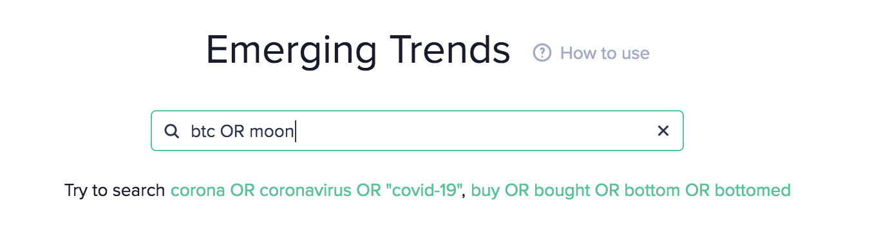

import Details from '$components/markdown/Details.svelte'

## Definition

Social Volume is build on top of the [Social Data](/metrics/details/social-data).

The total number of [social data text documents](/metrics/details/social-data) that
contain the given search term at least once. Examples of documents are telegram
messages and reddit posts. If a single short telegram message includes the word
`crypto` more than once, this message will increase the social volume of the
word `crypto` by 1. If a long reddit post contains the word `crypto` 10 times,
this again will increase the social volume of the word `crypto` by 1.

Social Volume can be computed for an [asset](/glossary#asset) or for arbitrary
search terms. When an asset is used, a special search term is constructed. For
example querying the social volume for `santiment` will result in a search term
similar to:

> (SAN OR santiment OR santoken OR santimentnet OR sancoin OR sansan OR sancoin)
> AND NOT ((san AND francisco) OR (san AND fran) OR (san AND diego) OR (san AND
> marino) OR (san AND jose))

which includes documents containg `santiment` or `san` but excludes documents
that contain common phrases containing `san` like `San Francisco`.

The arbitrary search term can be:

- One particular word like `bitcoin`, `crypto` or `blockchain`.
- An exact phrase (surrounded by double quotation marks) like `"when moon"`,
  `"buy high sell low"` or `"btc rekt"`.
- [Lucene Query](http://www.lucenetutorial.com/lucene-query-syntax.html) - a
  search term that allows for logical operators. Examples:
  - `OR` - The union of two search results. `btc OR bitcoin` returns the
    documents that contain at least one of the words `btc` and `bitcoin`
  - `AND` - The intersection of two search results. `btc AND moon` returns the
    documents that contain both of the words `btc` and `moon` at the same time.
  - `NOT` - Filter out documents that contain a given search term. `btc NOT lambo`
    returns the documents that contain the word `btc` and does not
    contain the word `lambo`
  - `?` - A wildcard search. `?` in the search term means that it can match any
    character. For example the query `btc AND 1?k` will be the combined result
    of `btc AND 10k`, `btc AND 11k`, ..., `btc AND 19k` (but also nonsense like
    `btc AND 1sk`, `btc AND 1Ak`, etc. will be matched)
  - Many other operators can be used, documentation for which can be found in
    the lucene query syntax documentation.

The operators can be combined and higher precedence can be expressed by using
parentheses `(btc OR bitcoin) AND moon NOT lambo` - it will result in all the
documents that contain either the words `btc` and `moon` or the words `bitcoin`
and `moon` in one document, excluding any documents that contain the word
`lambo`.

We constantly update our labels which helps us to keep labels as fresh as possible but result historical data changes. Any modifications to labels, social sources, or relevant jobs will prompt recalculation for the previous month's data. Within a 12 hour period, metric can be supplemented with new data.

---

## Access

[Restricted Access](/metrics/details/access#restricted-access).

---

## Measuring Unit

Amount of documents that mention the given text pattern.

---

## Data Type

[Timeseries Data](/metrics/details/data-type#timeseries-data)

---

## Change Metrics

[Change Metrics](/metrics/details/change_metrics)

---

## Frequency

[Five-Minute Intervals](/metrics/details/frequency#five-minute-frequency)

---

## Latency

[Social Data Latency](/metrics/details/latency#social-data-latency)

---

## Available Assets

Available for [these assets](<https://api.santiment.net/graphiql?variables=&query=%7B%0A%20%20getMetric(metric%3A%20%22social_volume_total%22)%20%7B%0A%20%20%20%20metadata%20%7B%0A%20%20%20%20%20%20availableSlugs%0A%20%20%20%20%7D%0A%20%20%7D%0A%7D%0A>)

> Note: `social_volume_total` metric and all metrics for a specific source are
> available for the same set of assets.

---

## Sanbase

Combined Social Volume from all sources for an asset can be seen on a [project's page](https://app.santiment.net/charts).

Social Volume for arbitrary search terms can be viewed from the [trends page](https://app.santiment.net/social-trends) 

The combined social volume from all sources is displayed. From the bottom of the
page social volume for a specific source can be displayed, too. 

## SanAPI

Available under the `social_volume_total` and `social_volume_<source>`
names, where the available sources are:

- 4chan
- telegram
- reddit
- twitter
- bitcointalk
- youtube_videos
- farcaster
- total (combines all sources)

### Social Volume for an asset

```graphql-explorer
{
  getMetric(metric: "social_volume_total") {
    timeseriesDataJson(
      selector: { slug: "santiment" }
      from: "2020-01-01T00:00:00Z"
      to: "2020-01-07T00:00:00Z"
      interval: "1d"
    )
  }
}
```

---

### Social Volume for arbitrary search term

```graphql-explorer
{
  getMetric(metric: "social_volume_telegram") {
    timeseriesDataJson(
      selector: { text: "btc AND 1?k" }
      from: "2020-01-01T00:00:00Z"
      to: "2020-01-07T00:00:00Z"
      interval: "1d"
    )
  }
}
```

---

### Market Social Volume

There is an option to get Market Social Volume

```graphql-explorer
{
  getMetric(metric: "social_volume_telegram") {
    timeseriesDataJson(
      selector: { slug: "crypto_market" }
      from: "2020-01-01T00:00:00Z"
      to: "2020-01-07T00:00:00Z"
      interval: "1d"
    )
  }
}
```

## Full list of metrics

The full list of Social Volume metrics is:

<Details>

<summary>Open Metrics List</summary>

- social_volume_4chan
- social_volume_bitcointalk
- social_volume_reddit
- social_volume_telegram
- social_volume_total
- social_volume_twitter
- social_volume_youtube_videos
- social_volume_farcaster

</Details>

<Details>

<summary>Open Change Metrics List</summary>

- social_volume_total_change_1d
- social_volume_total_change_30d
- social_volume_total_change_7d

</Details>
