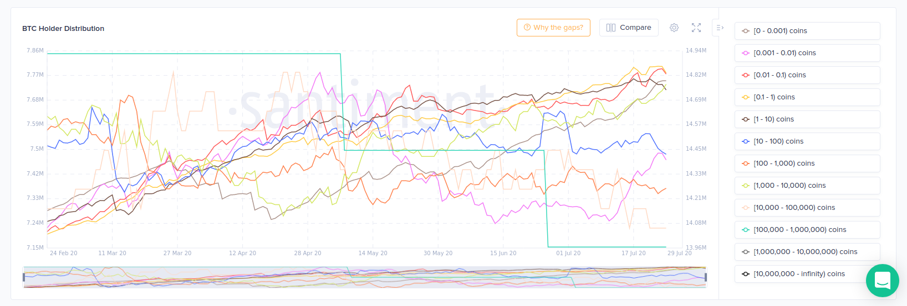

## Definition

There are five separate metrics regarding supply distribution:

- ``holders_distribution_<interval>`` - Represents the number of addresses holding the amount of tokens that belong to a given interval
- ``holders_distribution_combined_balance_<interval>`` - Represents the sum of all the tokens of all the addresses which hold the amount of tokens from an interval
- ``holders_distribution_over_<threshold>`` - The number of addresses whose balance exceeds ``threshold``
- ``holders_distribution_combined_balance_over_<threshold>`` - The sum of all the tokens of all the addresses whose balance exceeds ``threshold``
- ``percent_of_holders_distribution_combined_balance_<interval>`` - The percent of tokens contained in some interval. It is computed using the following formula:
$$
\frac{Supply Distribution Combined Balance For Interval}{Total Supply}
$$



Additionally, the above metrics can be calculated only for active holders. Active 
holders are holders that moved coins in the past year. 
To include only active holders add `active_` prefix (for example: 
`active_holders_distribution_<interval>`)

## Access

[Free Access](/metrics/details/access#free-access)

---

## Measuring Unit

For the ``<active_>holders_distribution_<interval>`` and ``<active_>holders_distribution_over_<threshold>`` they're integers, whilst for the rest they're floats

---

## Data Type

[Timeseries Data](/metrics/details/data-type#timeseries-data)

---

## Frequency

[Daily Intervals](/metrics/details/frequency#daily-frequency)

---

## Latency

[On-Chain Latency](/metrics/details/latency#on-chain-latency)

---

## Available Assets

Available for [these
assets](<https://api.santiment.net/graphiql?variables=&query=%7B%0A%20%20getMetric(metric%3A%20%22holders_distribution_1_to_10%22)%20%7B%0A%20%20%20%20metadata%20%7B%0A%20%20%20%20%20%20availableSlugs%0A%20%20%20%20%7D%0A%20%20%7D%0A%7D%0A>)

> Note: All of the metrics are available for the same set of assets.

---

## API

Available under the `<active_>holders_distribution_<interval>`, `<active_>holders_distribution_combined_balance_<interval>`, `<active_>holders_distribution_over_<threshold>`, `<active_>holders_distribution_combined_balance_over_<threshold>` and `percent_of_<active_>holders_distribution_combined_balance_<interval>` names.

```graphql
{
  getMetric(metric: "holders_distribution_1_to_10") {
    timeseriesData(
      slug: "santiment"
      from: "2020-01-01T00:00:00Z"
      to: "2020-01-07T00:00:00Z"
      interval: "1d"
    ) {
      datetime
      value
    }
  }
}
```

[Run in
explorer](<https://api.santiment.net/graphiql?variables=&query=%7B%0A%20%20getMetric(metric%3A%20%22holders_distribution_1_to_10%22)%20%7B%0A%20%20%20%20timeseriesData(%0A%20%20%20%20%20%20slug%3A%20%22santiment%22%0A%20%20%20%20%20%20from%3A%20%222020-01-01T00%3A00%3A00Z%22%0A%20%20%20%20%20%20to%3A%20%222020-01-07T00%3A00%3A00Z%22%0A%20%20%20%20%20%20interval%3A%20%221d%22%0A%20%20%20%20)%20%7B%0A%20%20%20%20%20%20datetime%0A%20%20%20%20%20%20value%0A%20%20%20%20%7D%0A%20%20%7D%0A%7D>)

```graphql
{
  getMetric(metric: "holders_distribution_combined_balance_1k_to_10k") {
    timeseriesData(
      slug: "santiment"
      from: "2020-01-01T00:00:00Z"
      to: "2020-01-07T00:00:00Z"
      interval: "1d"
    ) {
      datetime
      value
    }
  }
}
```

[Run in
explorer](<https://api.santiment.net/graphiql?variables=&query=%7B%0A%20%20getMetric(metric%3A%20%22holders_distribution_combined_balance_1k_to_10k%22)%20%7B%0A%20%20%20%20timeseriesData(%0A%20%20%20%20%20%20slug%3A%20%22santiment%22%0A%20%20%20%20%20%20from%3A%20%222020-01-01T00%3A00%3A00Z%22%0A%20%20%20%20%20%20to%3A%20%222020-01-07T00%3A00%3A00Z%22%0A%20%20%20%20%20%20interval%3A%20%221d%22%0A%20%20%20%20)%20%7B%0A%20%20%20%20%20%20datetime%0A%20%20%20%20%20%20value%0A%20%20%20%20%7D%0A%20%20%7D%0A%7D>)

```graphql
{
  getMetric(metric: "holders_distribution_over_10") {
    timeseriesData(
      slug: "santiment"
      from: "2020-01-01T00:00:00Z"
      to: "2020-01-07T00:00:00Z"
      interval: "1d"
    ) {
      datetime
      value
    }
  }
}
```

[Run in
explorer](<https://api.santiment.net/graphiql?variables=&query=%7B%0A%20%20getMetric(metric%3A%20%22holders_distribution_over_10%22)%20%7B%0A%20%20%20%20timeseriesData(%0A%20%20%20%20%20%20slug%3A%20%22santiment%22%0A%20%20%20%20%20%20from%3A%20%222020-01-01T00%3A00%3A00Z%22%0A%20%20%20%20%20%20to%3A%20%222020-01-07T00%3A00%3A00Z%22%0A%20%20%20%20%20%20interval%3A%20%221d%22%0A%20%20%20%20)%20%7B%0A%20%20%20%20%20%20datetime%0A%20%20%20%20%20%20value%0A%20%20%20%20%7D%0A%20%20%7D%0A%7D>)

```graphql
{
  getMetric(metric: "holders_distribution_combined_balance_over_1") {
    timeseriesData(
      slug: "santiment"
      from: "2020-01-01T00:00:00Z"
      to: "2020-01-07T00:00:00Z"
      interval: "1d"
    ) {
      datetime
      value
    }
  }
}
```

[Run in
explorer](<https://api.santiment.net/graphiql?variables=&query=%7B%0A%20%20getMetric(metric%3A%20%22holders_distribution_combined_balance_over_1%22)%20%7B%0A%20%20%20%20timeseriesData(%0A%20%20%20%20%20%20slug%3A%20%22santiment%22%0A%20%20%20%20%20%20from%3A%20%222020-01-01T00%3A00%3A00Z%22%0A%20%20%20%20%20%20to%3A%20%222020-01-07T00%3A00%3A00Z%22%0A%20%20%20%20%20%20interval%3A%20%221d%22%0A%20%20%20%20)%20%7B%0A%20%20%20%20%20%20datetime%0A%20%20%20%20%20%20value%0A%20%20%20%20%7D%0A%20%20%7D%0A%7D>)

```graphql
{
  getMetric(metric: "percent_of_holders_distribution_combined_balance_0_to_0.001") {
    timeseriesData(
      slug: "santiment"
      from: "2020-01-01T00:00:00Z"
      to: "2020-01-07T00:00:00Z"
      interval: "1d"
    ) {
      datetime
      value
    }
  }
}
```

[Run in
explorer](<https://api.santiment.net/graphiql?variables=&query=%7B%0A%20%20getMetric(metric%3A%20%22percent_of_holders_distribution_combined_balance_0_to_0.001%22)%20%7B%0A%20%20%20%20timeseriesData(%0A%20%20%20%20%20%20slug%3A%20%22santiment%22%0A%20%20%20%20%20%20from%3A%20%222020-01-01T00%3A00%3A00Z%22%0A%20%20%20%20%20%20to%3A%20%222020-01-07T00%3A00%3A00Z%22%0A%20%20%20%20%20%20interval%3A%20%221d%22%0A%20%20%20%20)%20%7B%0A%20%20%20%20%20%20datetime%0A%20%20%20%20%20%20value%0A%20%20%20%20%7D%0A%20%20%7D%0A%7D>)
