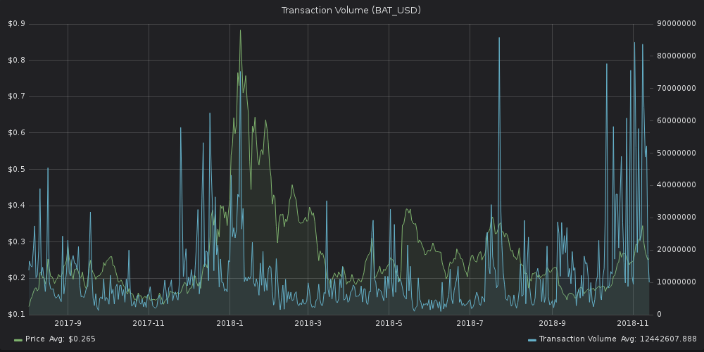

This graph shows the aggregate amount of tokens across all transactions
that happened on the network on a certain date. We currently offer
Transaction Volume for BTC, ETH (including all ERC20 tokens) and EOS.

A spike in transaction volume either signals:

1.  large amount of tokens moving, or
2.  large number of transactions

While not as strong of a price indicator as some other metrics in our
suite, Transaction Volume can still be used for thorough mid-term
analysis, or in tandem with other indicators.

Here's the trx volume graph for [Basic Attention
Token](https://basicattentiontoken.org/) (BAT), a decentralized ad
network:



The per-day graph is still a bit noisy, so let's smooth it out with a
7-day moving average (done with 1 click in Sandata):


As you can see, the correlation between price and trx volume can both be
evident and strenuous at different times.

That said, the metric remains a strong complementary signal in any
serious trading analysis.

### SanAPI

Fetch total amount of tokens for a project that were transacted on the
blockchain, grouped by interval. Projects are referred to by a unique
identifier (slug).

This metric includes only on-chain volume, not volume in exchanges.

Grouping by interval works by summing all transaction volume records in
the interval.

[**Run in
explorer**](https://api.santiment.net/graphiql?variables=%7B%7D&query=%7B%0A%20%20transactionVolume(from%3A%20%222019-05-12T09%3A45%3A27.283Z%22%2C%20interval%3A%20%221d%22%2C%20slug%3A%20%22dragonchain%22%2C%20to%3A%20%222019-06-26T09%3A45%3A27.283Z%22)%20%7B%0A%20%20%20%20datetime%0A%20%20%20%20transactionVolume%0A%20%20%7D%0A%7D%0A)

```js
{
  transactionVolume(from: "2019-05-12T09:45:27.283Z", interval: "1d", slug: "dragonchain", to: "2019-06-26T09:45:27.283Z") {
    datetime
    transactionVolume
  }
}
```

**Run in terminal**

```sh
curl \
  -X POST \
  -H "Content-Type: application/json" \
  --data '{ "query": "query{transactionVolume(from:\"2019-05-12T09:45:27.283Z\",interval:\"1d\",slug:\"dragonchain\",to:\"2019-06-26T09:45:27.283Z\"){datetime,transactionVolume}}" }' \
  https://api.santiment.net/graphql
```

