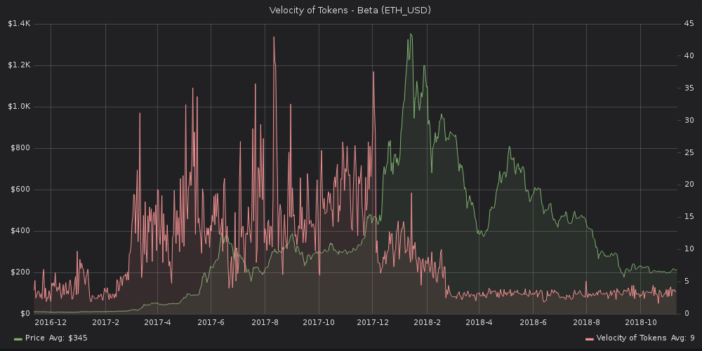

*For a more in-depth explanation of `Velocity of Tokens`, please
click* [*here*](https://community.santiment.net/t/token-velocity-metric/412/2).

This graph shows the average number of times that a token changes
wallets each day.

Simply put, a higher token velocity means that a token is used in
transactions more often within a set time frame.

Token Velocity can be used to explain various noteworthy events in the
life of a project. For example, here's Ethereum:



Notice the steep drop off?

The increased activity (and subsequent dip) correlates squarely to a
huge ETH mixer that operated between March 2017 and March 2018.

Once the mixer was liquidated, token velocity toppled back to 'normal'
levels, where it's remained ever since.


### SanAPI

Similar to velocity of money, Token Velocity is the frequency at which
tokens change wallets in a given interval of time. This metric is
derived by dividing transaction volume by the number of tokens in
circulation, to get the average number of times a token changes hands
each day.

This metric is calculated daily, so the interval should represent whole
days.

Grouping by interval works by taking the mean of all daily results over
the interval.

[**Run in
explorer**](https://api.santiment.net/graphiql?query=%7B%0A%20%20tokenVelocity(from%3A%20%222019-05-09T11%3A25%3A04.894Z%22%2C%20interval%3A%20%221d%22%2C%20slug%3A%20%22ethereum%22%2C%20to%3A%20%222019-06-23T11%3A25%3A04.894Z%22)%20%7B%0A%20%20%20%20tokenVelocity%0A%20%20%20%20datetime%0A%20%20%7D%0A%7D%0A&variables=)

```js
{
  tokenVelocity(from: "2019-05-09T11:25:04.894Z", interval: "1d", slug: "ethereum", to: "2019-06-23T11:25:04.894Z") {
    tokenVelocity
    datetime
  }
}
```

**Run in terminal**

```sh
curl \
  -X POST \
  -H "Content-Type: application/json" \
  --data '{ "query": "query{tokenVelocity(from:\"2019-05-09T11:25:04.894Z\",interval:\"1d\",slug:\"ethereum\",to:\"2019-06-23T11:25:04.894Z\"){tokenVelocity,datetime}}" }' \
  https://api.santiment.net/graphql
```

