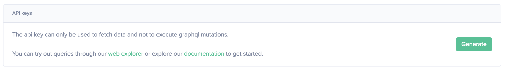
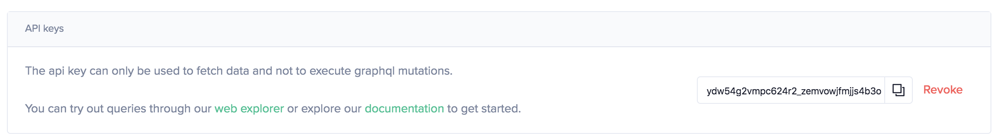

# How to create an API key

All of our current products use the [Sanbase](https://app.santiment.net)
account as reference. Sangraphs let you directly use Sanbase as a login
option, but this does not work for the API or for Sansheets. This is
where an API key comes in.

When you make a Sanbase account you are able to create an API key that
carries the same access rights, to use with these other products. The
access rights that are assigned to this key depend on your
subscription plan.

## Creating an API key

Creating API keys is done in the account settings of
[Sanbase](https://app.santiment.net/account),
[SanAPI](https://api.santiment.net/account) or
[Sansheets](https://sheets.santiment.net/account).

In accounts settings you should click on the **`Generate`** button to
create the new key.

The key will be shown as a string. You can copy it
and use it wherever you need.

The key can be revoked from the same place anytime.

## Using an API key

The [authentication section](/sanapi#authentication) shows how to include an API key in your requests.
