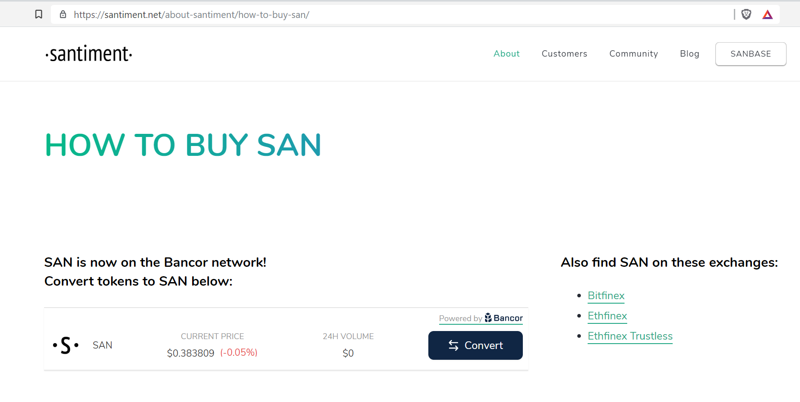
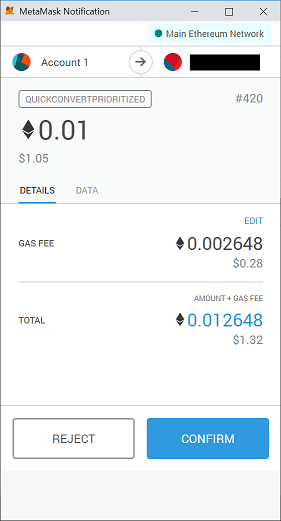

We have recently added an option to trade for SAN tokens straight [on
our homepage](https://santiment.net/about-santiment/how-to-buy-san/):

The same can be found in your Sanbase account settings.

To use it you need to have ETH (or ERC-20 tokens supported by Bancor) in
your account registered in MetaMask. Please note that MetaMask can also
be used with Trezor and Ledger hardware wallets. Have your MetaMask
ready and click on `Convert`. In the following screen select
`MetaMask` and click `Next`:

After clicking `CONNECT` on the following screen to allow Bancor to
connect to your MetaMask\...

\...you will get to the actual convert-screen:

You can adjust the the amount to your liking and click `Next` to be
shown a final confirmation screen:

Clicking `Proceed` will create the actual transaction, which needs to
be signed by MetaMask:

Check the gas price, confirm that the receiving address is correct - and
you are ready to hit `CONFIRM` and get your SAN tokens.

After your transaction has been included in a block, you will find your
SAN token in your Ethereum account.
