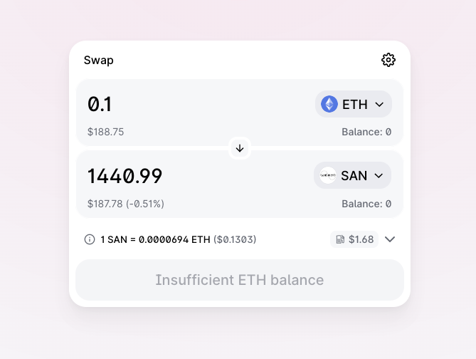

# How to Buy SAN

To use the SAN token with our platform, you need to have it in a MetaMask wallet or a wallet supported by MetaMask (like Trezor or Ledger). We'll describe the three steps necessary to achieve that.

## Step 1: Install and set up MetaMask

For instructions on how to install and set up MetaMask, see <https://metamask.io>. You will need an Ethereum address that will be used to hold SAN tokens, as well as to interact with the Santiment platform. You can either create a new wallet in MetaMask, import an already existing wallet, or connect MetaMask to a hardware wallet like __Ledger__ or __Trezor__.

<mark>__Result of Step 1:__ Installed and working Metamask</mark>

## Step 2: Add funds to MetaMask wallet

To get SAN tokens, you will need to swap them for ETH or another ERC20 token. You may acquire ETH from a centralized exchange like [Bitfinex](https://bitfinex.com/t/ETH:USD) and then transfer it to your MetaMask wallet.

<mark>__Result of Step 2:__ Metamask wallet with ETH or ERC-20 token balance</mark>

## Step 3: Swap ETH to SAN Tokens

You can use decentralized exchanges or decentralized exchange aggregators to swap ETH or some other ERC20 token for SAN tokens. They all work very similarly. Connect your Metamask wallet first, and then swap ETH for SAN tokens.

## Decentralized exchanges

### Uniswap

The SAN token is also available on [Uniswap](https://uniswap.exchange/swap) at the best rates. 

### Kyber

San tokens are also available on [Kyber](https://kyber.network/) via [Kyber Swap](https://kyberswap.com/swap/eth-san). If you don’t have any crypto, you may get it on [Kyber](https://kyberswap.com/buy-crypto) using your credit card.

### Bancor

The SAN token is available on [Bancor](https://app.bancor.network/trade). Once you connect your Metamask, you can [purchase ETH on Bancor](https://app.bancor.network/fiat) using your credit card to swap for SAN Tokens afterward.

### Decentralized exchange aggregators

You can use a decentralized exchange aggregator like [ParaSwap.io](http://app.paraswap.io/) or [1inch.exchange](https://1inch.exchange/) to get SAN tokens. Using an aggregator could sometimes give you a lower price than using an exchange directly.

<mark>__Result of Step 3:__ Metamask wallet with SAN token balance</mark>

## What to do next?

Now just [login with a MetaMask](https://app.santiment.net/login) account, which holds the SAN tokens. Alternatively, you can [connect your Sanbase](/san-tokens/how-to-stake-san/) account with your Metamask wallet in the settings.

We'll detect the SAN you're holding and grant you access to our discounts, based on the amount of tokens you hold.

!<Resource title="Here are a few resources you can refer to:">
🔮 [Connect a wallet to the Sanbase account](/san-tokens/connect-a-wallet-to-the-sanbase-account/)

💎 [SAN tokens holding benefits](/san-tokens/san-tokens-holding-benefits)
</Resource>!
