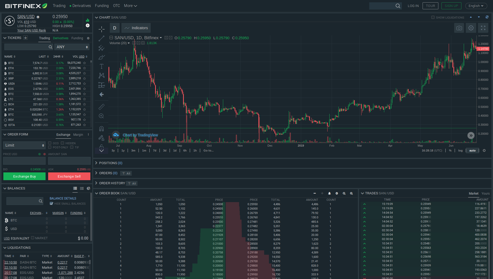

In order to use the SAN token with our platform, you need to have it in
a MetaMask wallet or a wallet supported by MetaMask (like Trezor or
Ledger). We'll describe the steps necessary to achieve that.

## Install and set up MetaMask

For instructions on how to install and set up MetaMask, see
<https://metamask.io>. You will need an Ethereum address that will be
used to hold SAN tokens and to interact with the Santiment
platform. You can either create a new wallet in MetaMask, import an
already existing wallet or connect MetaMask to a hardware wallet like
Ledger or Trezor.

Please take proper care of the security of your wallet. Make sure that
you have its recovery phrase stored somewhere safe. In general if
you hold significant amount of assets it is recommended to use a
hardware wallet.

## Get SAN tokens

There are currently two main ways to acquire SAN tokens - using
decentralized or centralized exchanges.

### Decentralized exchanges

In order to get SAN through a decentralized exchange you will need to
trade it for ETH or for some other ERC20 token. If you decide to
go this route, you have to acquire ETH from somewhere (for example from
a centralized exchange like
[Bitfinex](https://bitfinex.com/t/ETH:USD)) and then transfer it to
your Ethereum wallet.

After you have finished this initial step you can acquire SAN from the
following exchanges:

#### Bancor

Santiment has an integration with Bancor which allows you to swap SAN
for ETH or for any other Bancor-supported asset with a _single
transaction_. To see how to use it please check out [this
article](/san-token/buy-san-token-using-bancor).

You can also purchase tokens on the [main Bancor site](https://www.bancor.network).

#### Kyber

Santiment is available on [Kyber](https://kyber.network/) via
[Kyber Swap](https://kyberswap.com/swap/eth-san). With Kyber Swap you can also get
SAN to your wallet with a single transaction

#### Uniswap

The SAN token is also available on
[Uniswap](https://uniswap.exchange/swap). Like Bancor and Kyber you
can swap tokens for ETH with a single transaction

#### Decentralized exchange aggregators

You can use a decentralized exchange aggregator like
[DEX.AG](https://dex.ag) or [1inch.exchange](https://1inch.exchange)
to get SAN tokens. Using an aggregator could sometimes give you a
lower price than using an exchange directly.

#### DeversiFi (previously trustless.ethfinex.com)

You can buy SAN tokens on [DeversiFi](https://deversifi.com). Trades
on DeversiFi are more complicated and it requires several transactions
to complete a trade from start to finish and to get the tokens in your
wallet. On the other hand that may allow you to get a better deal than
on Bancor, Kyber or Uniswap.

### Centralized exchanges

<https://coinmarketcap.com/currencies/santiment/#markets> lists
several different centralized exchanges on which SAN tokens are
traded. We recommend [Bitfinex](https://www.bitfinex.com/t/SAN:USD)
which has the highest liquidity. There SAN can be exchanged for ETH,
BTC and USD/USDT.

Please refer to the documentation of your chosen exchange for more
details.

In case you used a centralized exchange to buy your SAN tokens, you
need to withdraw them to the account you use with MetaMask. This step
is already taken care of in case you used Bancor, Kyber or Uniswap.

## What to do next?

Now just login to MetaMask, select the account which holds the SAN tokens,
visit Sanbase and [log in by
MetaMask](/intercom-articles/getting-started/sanbase/logging-into-sanbase).
We'll detect the SAN you're holding and grant you access to our
discounts, based on the amount of tokens you hold.

> **Note:** We currently have an older [copy of this article
up on our
forums](https://community.santiment.net/t/short-guide-how-to-buy-san-token/1062),
where some additional options and comments can be found.
