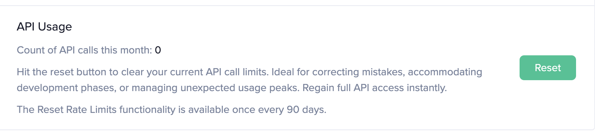

## Overview

Santiment API Rate Limiting is a mechanism that restricts the number of
requests a user can make within a specific time frame. This limitation is
crucial for maintaining stability and optimal performance for a large number of
clients. 

1. **Maintaining Service Stability and Performance:** API Rate Limits prevent a
   single entity from excessively using the API service, which could
   potentially degrade the performance for other users.

2. **Fair Resource Allocation:** API Rate Limits ensure a more equitable
   distribution of API resources among users. They prevent individual users or
   applications from monopolizing the available resources, ensuring that all
   users have equal access and opportunity to use the API services.

3. **Protection Against Malicious Activities:** API Rate Limits serve as a
   basic security measure to protect against malicious activities such as DoS
   (Denial of Service) attacks. By limiting the number of requests from a
   single source, Santiment can mitigate potential harm.

## How are API calls counted?

Each [GraphQL Query](https://academy.santiment.net/glossary/#query) is counted
as one API call. One GraphQL request can contain any number of GraphQL queries
inside of it. This means that one GraphQL request can count as multiple API
calls. In most cases, a single GraphQL request will contain only one GraphQL
query.

Executing the following GraphQL request will count as 1 API calls:
```graphql
{
  getMetric(metric: "active_addresses_24h") {
    timeseriesData(
      slug: "ethereum"
      from: "2019-01-01T00:00:00Z"
      to: "2019-01-01T03:00:00Z"
      interval: "30m"
    ) {
      datetime
      value
    }
  }
}
```

Executing the following GraphQL request will count as 2 API calls:

```graphql
{
  activeAddresses: getMetric(metric: "active_addresses_24h") {
    timeseriesData(
      slug: "ethereum"
      from: "2019-01-01T00:00:00Z"
      to: "2019-01-01T03:00:00Z"
      interval: "30m"
    ) {
      datetime
      value
    }
  }

  transactionVolume: getMetric(metric: "transaction_volume") {
    timeseriesData(
      slug: "ethereum"
      from: "2019-01-01T00:00:00Z"
      to: "2019-01-01T03:00:00Z"
      interval: "30m"
    ) {
      datetime
      value
    }
  }
}
```

## How are rate limits applied and refreshed?

API Rate Limits are applied on a **per account** basis. This means that all API
keys associated with a single account share the same limits. It's important to
note that API keys used for testing or development purposes can impact the rate
limits of the API key used for production. 

The rate limits vary based on the subscription plan. You can find the details
for each plan in [this article](products-and-plans/sanapi-plans). 

Rate limits are applied on a **per minute**, **per hour** and **per month**
basis, with all dates and times set to the UTC timezone. 

The refreshment of these limits occurs **at the start of the next minute, hour,
or month**. This means that regardless of when the subscription was created,
the count of API calls will reset at the start of the next month, specifically
at 00:00:00 UTC on the 1st of the month. 

## How to Determine If You Are Being Rate Limited?

When the rate limit is reached, an error response with HTTP code 429 is
returned. The content of the response body includes a human-readable format of
the error and the remaining time until you can make another request. The
remaining time, measured in seconds, is also provided as the value of the
`x-ratelimit-reset` HTTP header.

Several other HTTP headers provide information about the rate limits:

The following three HTTP headers indicate the limits of your current
subscription plan. These values remain constant from request to request and
only change when your subscription plan changes:

- `x-ratelimit-limit-month`
- `x-ratelimit-limit-hour`
- `x-ratelimit-limit-minute`

The next three HTTP headers change from request to request and show the number
of API calls remaining before you reach the limit of allowed API calls:

- `x-ratelimit-remaining-month`
- `x-ratelimit-remaining-hour`
- `x-ratelimit-remaining-minute`

## What to do if the rate limits are reached?

Rate limits can be reached for various different reasons:
- Excessive usage of the API during a development phase;
- Programming error that consumes many API calls;
- Unexpected usage peak;
- Need for more API calls in the long term.

In case of a temporary issue or error, you can go to you [Account page](https://app.santiment.net/account#api-keys)
and press the `Reset`. The self-reset of API rate limits is available once per 90 days:


Contact Santiment support if additional issues are encountered.

In case the need for more API calls is long-term, please consider upgrading to a higher subscription plan.
If the highest subscription plan does not cover your needs, contact Santiment support.


<Notebox type="none">
**Read next: [Historical and Realtime data restrictions](/sanapi/historical-and-realtime-data-restrictions)**
</Notebox>
