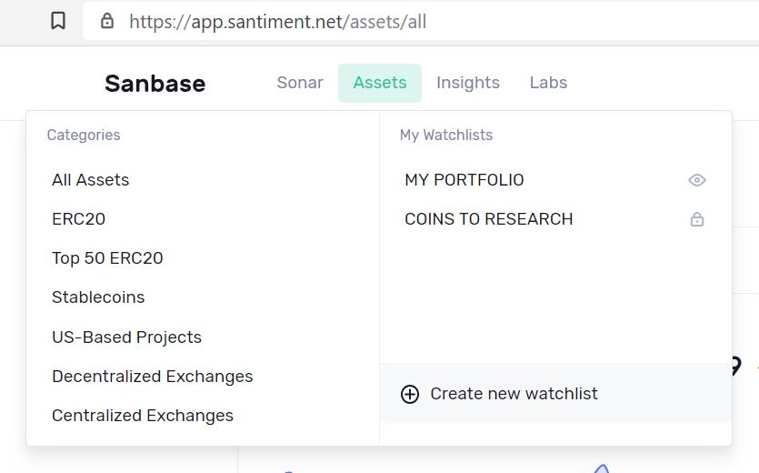
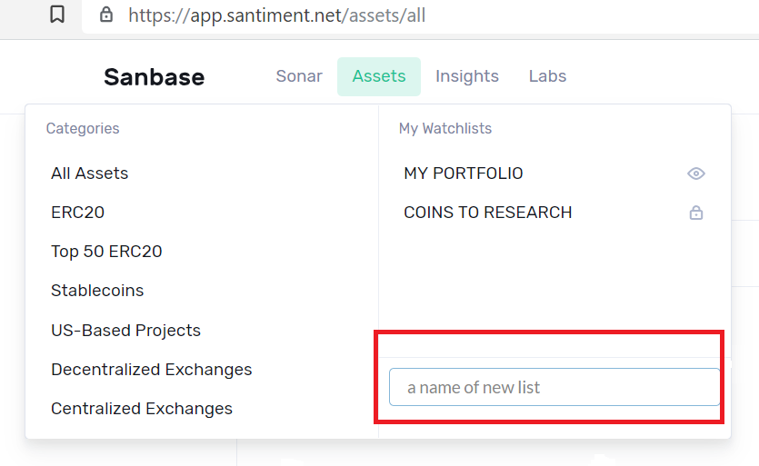
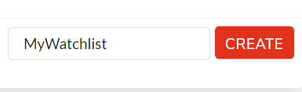
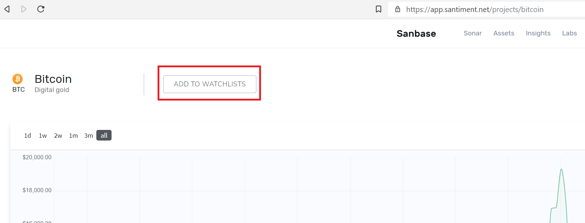
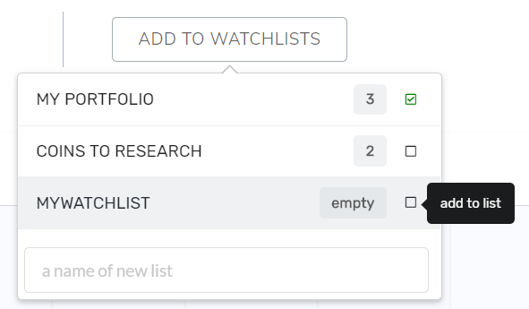
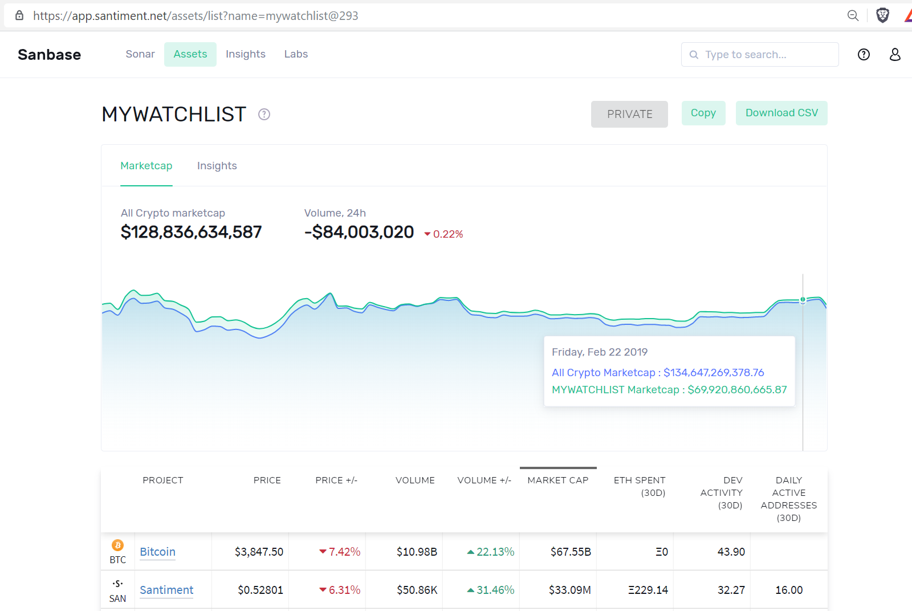
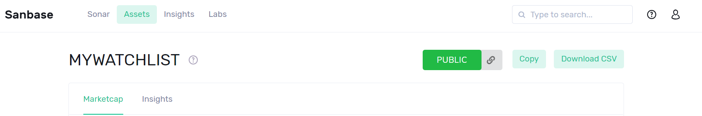

Looking at the [assets
list](/intercom-articles/getting-started/sanbase/the-assets-page)
on [SANbase](https://app.santiment.net/assets/all), you will find a
navigation bar in the upper left corner of the screen. Hovering over
Assets\', you will be shown the following:

::: {.intercom-container .intercom-align-left}

:::

Categories {#categories .intercom-align-left data-post-processed="true"}
----------

These topics mentioned on the left are specific asset lists that the
Santiment team created based on a certain aspect of the assets, e.g.
\'Stablecoins\'. In case you have any Feedback on these or you think we
might be missing tokens in one of them, please consider getting in
touch.

A current list of categories and their explanation can be found in [this
article](/intercom-articles/getting-started/sanbase/navigating-through-sanbase).\

Watchlists {#watchlists .intercom-align-left data-post-processed="true"}
----------

Watchlists are basically the same as Categories, but can be created by
anyone. On the right side you will see all your watchlists as well as
the option to create a new one at the bottom:

::: {.intercom-container .intercom-align-left}

:::

As soon as you enter a name, you will have the option to confirm and
hereby create the watchlist:

::: {.intercom-container .intercom-align-left}

:::

#### Adding assets to a watchlist {#adding-assets-to-a-watchlist .intercom-align-left data-post-processed="true"}

Assets can be added to a watchlist from the asset\'s own page, e.g.

[*https://app.santiment.net/projects/bitcoin*](https://app.santiment.net/projects/bitcoin)

Single assets can be found through the search or through existing
categories, like \'All assets\'.

The option to add an asset to a watchlist is quite prominent, to be
found in the upper left:

::: {.intercom-container .intercom-align-left}

:::

Clicking this button will show a list of all your watchlists and give
you the chance to add them to any of them:

::: {.intercom-container .intercom-align-left}

:::

To display your watchlist, simply click its title in the Assets-menu.
This will show its content, displayed just like any other asset list:

::: {.intercom-container .intercom-align-left}

:::

#### Sharing a watchlist {#sharing-a-watchlist .intercom-align-left data-post-processed="true"}

At the top right of the table, you can see that your watchlist is still
private. Clicking \'PRIVATE\' once will switch it to \'PUBLIC\' and
create a link to your watchlist that can be copied to the clipboard with
a single click, to be shared wherever you like:

::: {.intercom-container .intercom-align-left}

:::

***Did you create a valuable watchlist that we should know about? Please
join our community*** [***on Discord***](https://santiment.net/discord)
***and share it!***
