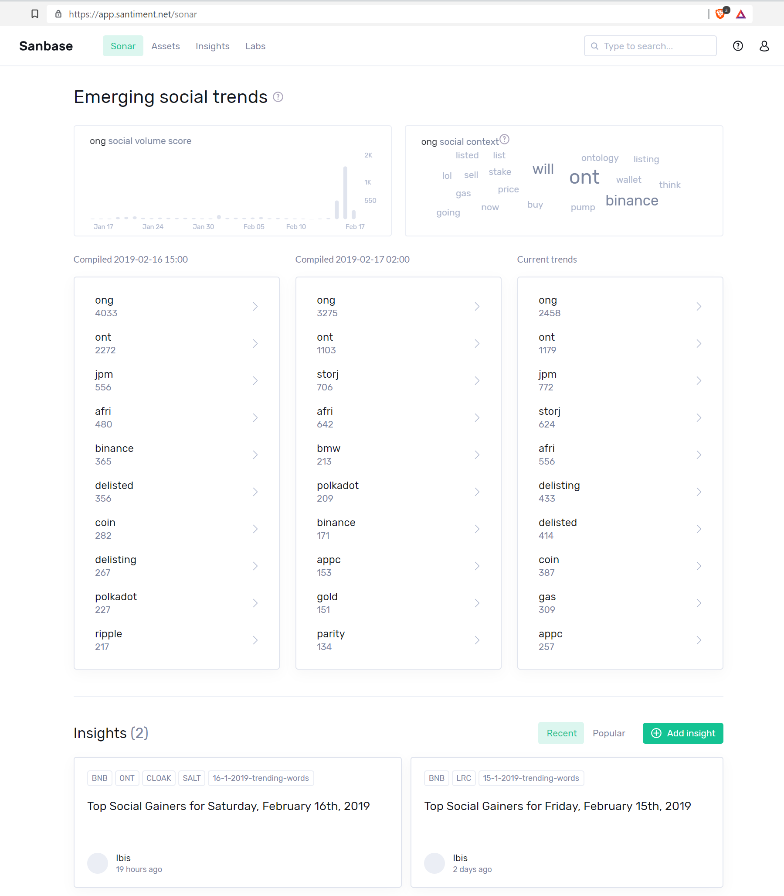

When looking at our Sonar overview page on Sanbase you will see our
`Emerging social trends` lists in the middle of the page:

These lists do not simply contain the most used terms across all our
social data sources, but rather calculate how quickly a certain one is
raising in frequency. This way you will be able to pick up on trends
before they have reached their peak of interest from the community.

Hovering your mouse over a certain word will show you historical trend
scores for that word in the top left, as well as create the according
word cloud at the top right of the page, possibly giving you insight
about the context that term was used in.

Click
[here](/intercom-articles/getting-started/sanbase/word-context)for
more information on the word cloud or
[here](/intercom-articles/getting-started/sanbase/insights)for
more information about the Insights feature shown at the bottom of the
Sonar page.
