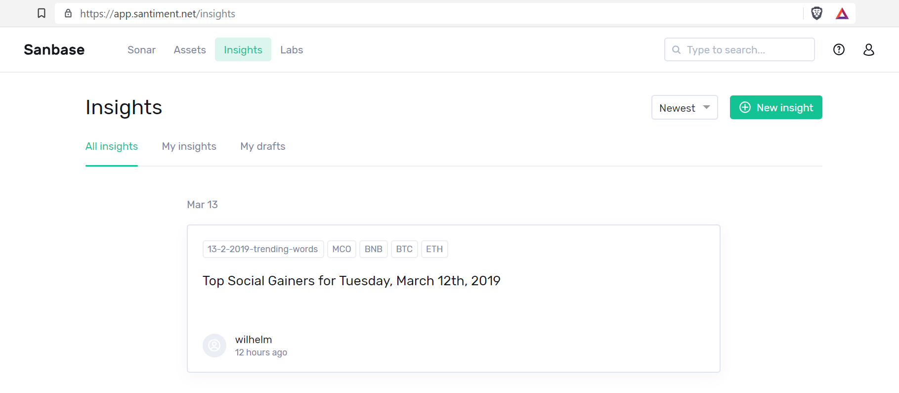
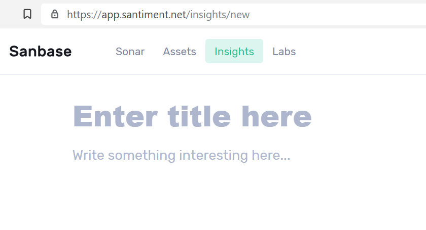
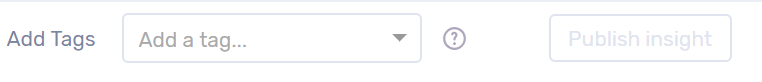

You can use our Insights feature to create your own note-like posts,
share them with the community or browse already existing Insights.

In the upper left of the Insights page, you can switch between showing
all recent Insights and showing only the ones you created yourself. `My
drafts` shows Insights you started but did not publish yet.

## Create a new Insight

Click `New insight` in the upper right to start the process of
creating a new one.

When creating an Insight you will be prompted to enter the title and the
body of it:

After you wrote your Insight, please note the bar at the bottom of the
page:

You are asked to add tags to your idea. Insights can have up to five
tags, which should correspond to the tickers of the crypto assets your
Insight is talking about.

As soon as all fields are filled, Sanbase will start saving your
progress as a draft:

As you can see, you also have the option to straight up share your
Insight with the public.

## Publish or delete Insight drafts

Under My drafts you will find all the Insights you started but did not
publish yet. They can be deleted or edited (and then shared) with the
buttons on the right:

## Insights about Insights

You can check out [this Insight](https://app.santiment.net/insights/33)
(for traders and investors) or [this
Insight](https://app.santiment.net/insights/34) (for researchers) to
find out more about our ideas regarding this feature.
