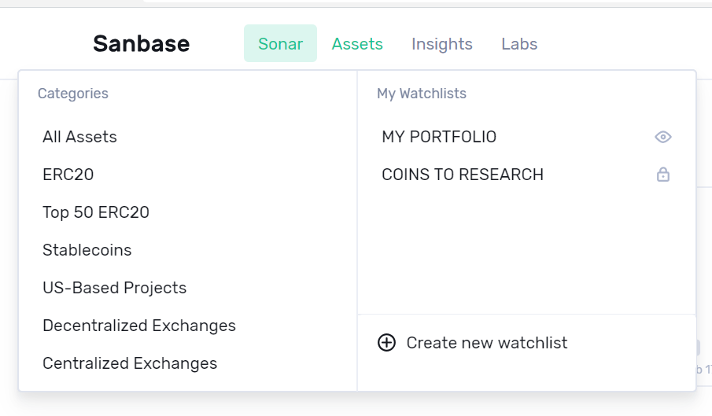
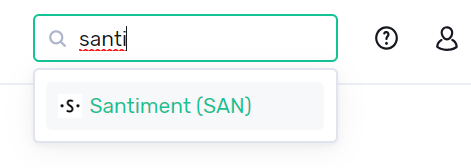
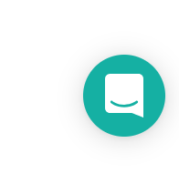
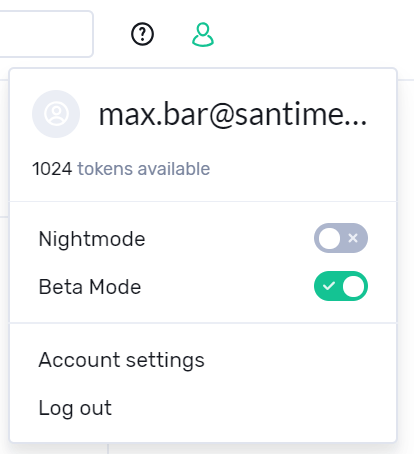

\
You will find several navigation options at the top of the SANbase page:

::: {.intercom-container .intercom-align-left}

:::

In this article we will go through them one by one and supply you with
links to more information.\

Sonar {#sonar .intercom-align-left data-post-processed="true"}
-----

When you first open up SANbase, you will start on the \'Sonar\' overview
page.

*To find out more about this overview, please check* [*this
article*](/intercom-articles/getting-started/sanbase/emerging-social-trends)*.*

::: {.intercom-container .intercom-align-left}

:::

Assets {#assets .intercom-align-left data-post-processed="true"}
------

::: {.intercom-container .intercom-align-left}

:::

***\'All Assets\'*** - this links to the [All Assets
overview](/intercom-articles/getting-started/sanbase/the-assets-page)\
***\'ERC 20\'*** - this shows Ethereum-based ERC20 tokens only\
***\'Top 50 ERC20\'*** - this shows the 50 most prominent ERC20 projects
we track\
***\'Stablecoins\'*** - a curated list of assets that are supposed to
have a fixed value\
***\'US-Based Projects\'*** - a curated list of blockchain projects
based in the USA\
***\'Decentralized Exchanges\'*** - a curated list of decentralized
exchanges and their utility tokens\
***\'Centralized Exchanges\'*** - a curated list of regular exchanges
and their utility tokens

Each list functions similar to the \'All Assets\' list mentioned above.
To find out more about \'Watchlists\' mentioned on the right side,
please check out [this
article](/intercom-articles/getting-started/sanbase/categories-and-watchlists).\

Insights {#insights .intercom-align-left data-post-processed="true"}
--------

Insights can be created straight from the Sonar page, as well as from
the Assets-pages, when switching over from Marketcap in the upper left:

::: {.intercom-container .intercom-align-left}

:::

To find more about Insights in general, please [check out this
article](/intercom-articles/getting-started/sanbase/insights).\

Labs {#labs .intercom-align-left data-post-processed="true"}
----

This holds our most recent findings and experiments:

::: {.intercom-container .intercom-align-left}

:::

***\'Social Trends\'*** - Lets you search for specific terms and see how
widely they are used in different crypto-relevant communication
platforms, such as Telegram, plotted against the price of an asset of
your choice. Find out more
[here](/intercom-articles/getting-started/sanbase/social-trends).***\
\'ETH Spent\'*** - this special overview shows a graph of Ethereum and a
list of ERC20 projects, which held an ICO, and their spendings.\
***\'Historical balance\'*** - Enter any Ethereum address and see the
change of balance over time\
***\'Word context\'*** - Search for any word and see a word cloud with
the most related terms, find out more about it
[here](/intercom-articles/getting-started/sanbase/word-context).\
***\'Dashboard\'*** - This section currently links to
\'[SANgraphs](https://santiment.net/dashboards)\', formerly \"SANbase
Dashboards\", where we host new cutting-edge metrics that are not yet
available on SANbase.

Search {#search .intercom-align-left data-post-processed="true"}
------

The search can be used to find any token that is known to our database,
e.g. our SAN token:

::: {.intercom-container .intercom-align-left}

:::

You can search for the name or the ticker of a token.\

Help {#help .intercom-align-left data-post-processed="true"}
----

::: {.intercom-container .intercom-align-left}

:::

***\'Documentation\'*** - this link will lead you to the knowledge base
you are using right now\
***\'Developer API\'*** - this will lead you to our current API
documentation\
***\'Support\'*** - click here to send us an email. Please also note the
chat icon in the lower right corner of any of our pages, which you can
use to quickly get in contact with our support team

::: {.intercom-container .intercom-align-center}

:::

Account and settings {#account-and-settings .intercom-align-left data-post-processed="true"}
--------------------

::: {.intercom-container .intercom-align-left}

:::

***\'tokens available\'*** - How many SAN tokens are associated with
your account. Check [this
article](/intercom-articles/getting-started/san-tokens-and-metamask/how-to-stake-san)
on how to stake SAN tokens or [this
article](/intercom-articles/faq/general/what-you-can-currently-do-with-your-san-tokens)
on what to use them for.***\
\'Night Mode\'*** - Switch the color scheme of the page to a darker
one***\
\'Beta Mode\'*** - This switch enables new (but possibly not fully
tested) functionality on SANbase. Feel free to look but be aware its
beta!***\
\'Account settings\'*** - This section includes your account settings
such as email address, account name, etc. You can find more information
[here](/intercom-articles/getting-started/sanbase/account-settings).\
***\'Log out\'*** - Logs you out of SANbase
