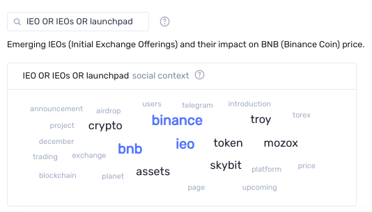

*This article is about **Social trends search** feature.
For more information about **Emerging Social trends** lists from `Labs -> Social trends` page,
please have a look at [this article](/sanbase/about/emerging-social-trends).*

With `Social trends search` you can display the amount of times your
search term or phraseis mentioned in a specific medium.

## Channels

To filter out the noise and only present relevant results, we focused on channels where at least 90% of all discussions center on crypto:
- Telegram channels
- Discord channels
- Reddit
- Proffessional traders chat

For additional context, the results are plotted against the price of BTC or ETH, allowing you to correlate market reactions to everyplace crypto chatter:

## OR, AND, and parentheses

One graph will be displayed for the total mentions, as well as one for
each data source. `AND`, `OR` (as well as parentheses) can be used
to logically combine multiple search terms.

For example:

- `btc moon` – for that exact phrase.
- `btc AND moon` – for messages where both words appear, regardless if they’re next to each other or not.
- `btc OR moon` – for messages where either word appears.
- `(btc OR bitcoin) AND moon` – for messages where moon appears either with `btc` or `Bitcoin`

Refer to [this blog post](https://santiment.net/blog/introducing-social-trends/) for examples of how to use this tool.

Refer to [this](/general/metrics/social-volume-metrics/) and [this article](/general/metrics/sentiment-metrics/) for more information about how it works.

## Social context

You could find a `word cloud` above the charts. It's show which words are most often used alongside your main keyword on crypto social media. Larger words are found more frequently in comments that also include your main keyword.
