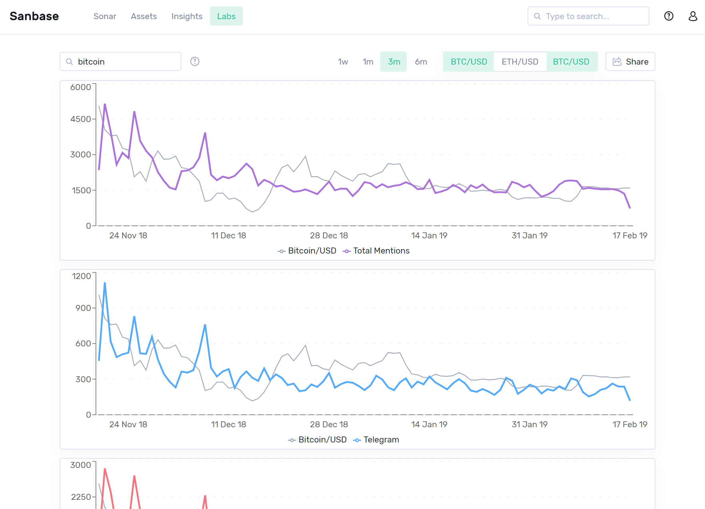

*This article is about the \'Social Trends\' search feature. For more
information on our \'Emerging Social trends\' lists on our Sonar page,
please have a look at* [*this
article*](/intercom-articles/getting-started/sanbase/emerging-social-trends)*.*

Using the Social Trends feature you can display the amount of times your
search term is mentioned in a specific medium (e.g. Telegram). You will
be supplied with a graph showing the amount of mentions at each data
point, plotted agains the price of either BTC or ETH in USD:

::: {.intercom-container .intercom-align-left}

:::

One graph will be displayed for the total mentions, as well as one for
each data source. \'AND\', \'OR\' (as well as parentheses) can be used
to logically combine multiple search terms. Please refer to [this blog
post](https://santiment.net/blog/introducing-social-trends/) for a more
detailed description on how to use these terms.\

Word Cloud {#word-cloud .intercom-align-left data-post-processed="true"}
----------

In case you only searched for a single search term, you will find a word
cloud above the graphs. This is created by displaying other words which
are often used in combination with your search term; bigger words were
mentioned more often. The word clouds uses the combined messages of all
above data sources. This functionality can also be found under \'Labs\'
-\> \'Word context\' and is described in [this
article](/intercom-articles/getting-started/sanbase/word-context).
