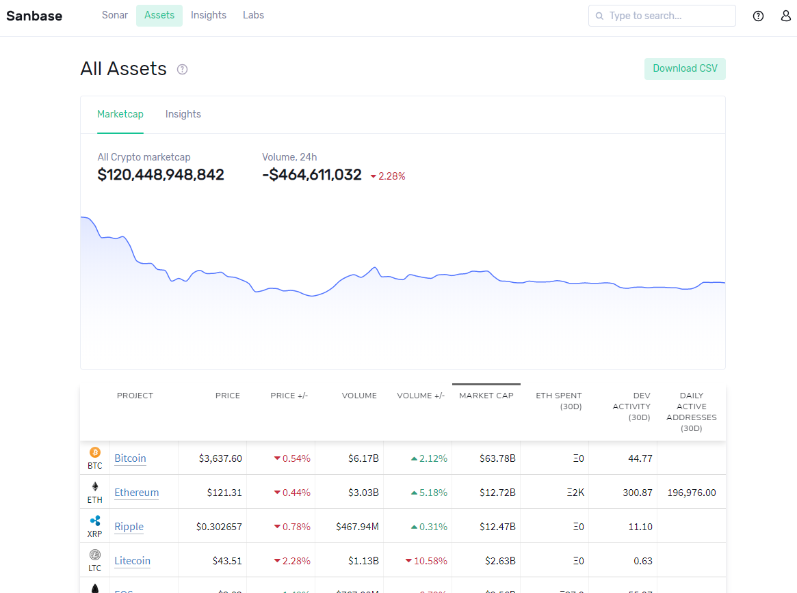
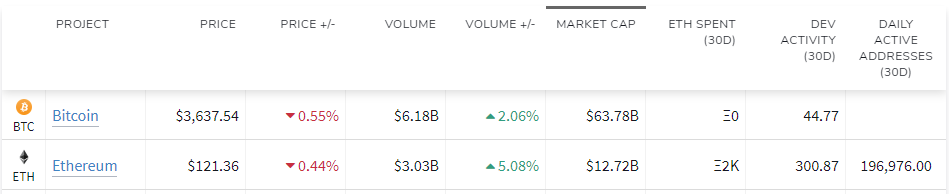
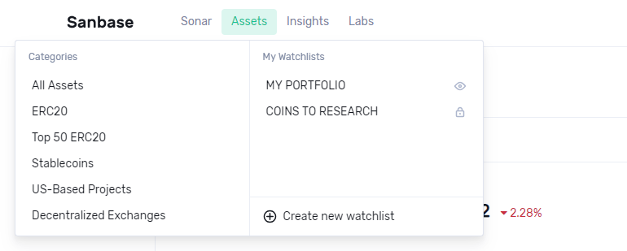

The \'All Assets\' overview contains all tokens we track across
different blockchains. These are first sorted by market cap.

::: {.intercom-container .intercom-align-left}

:::

By sorting on other table columns, you might be able to spot high-level,
general trends. For instance, by sorting on Daily Active Addresses, or
Dev Activity, a pattern could emerge that is worth investigating. Just
click on a column\'s title to sort by this column. Click again to
reverse the order.

::: {.intercom-container .intercom-align-left}

:::

#### Here\'s a description of each column: {#heres-a-description-of-each-column .intercom-align-left data-post-processed="true"}

***\'PRICE\'*** - The current token price.\
***\'PRICE +/-\'*** - The relative price change over the last 24 hours\
***\'VOLUME\'*** - The total trading volume of the asset over the last
24 hours, converted to USD\
***\'VOLUME +/-\'*** - This works like \'PRICE +/-\', but for trading
volume\
***\'MARKET CAP\'*** - The current [market
cap](https://en.wikipedia.org/wiki/Market_capitalization) of the asset\
***\'ETH SPENT (30D)\'*** - How much ETH was transferred out of the
team/ICO wallet during the last 30 days (only applies to ETH-based or
ICO projects)\
***\'DEV ACTIVITY (30D)\'*** - An indicator of how productive the
project\'s team is on Github; we\'ve custom-developed our own metric and
share our approach in [this Medium
article](https://medium.com/santiment/tracking-github-activity-of-crypto-projects-introducing-a-better-approach-9fb1af3f1c32).
This metric is also available on SANgraphs and has its [own
article](/intercom-articles/metrics-explained/sangraphs/metric-developer-activity)
here.\
***\'DAILY ACTIVE ADDRESSES (30D)\'*** - The amount of active addresses
within the last 24 hours. This metric is also available on SANgraphs and
has its [own
article](/intercom-articles/metrics-explained/sangraphs/metric-daily-active-addresses)
here.

Use Cases {#use-cases .intercom-align-left data-post-processed="true"}
---------

Here are the sorts of things you might learn just by looking at the
Assets table and doing some basic sorting.

-   What projects are trending for dev activity

<!-- -->

-   Are there spikes in daily active addresses for certain tokens

<!-- -->

-   is crypto in general going through a price spike or fall (most or
    all assets in the red or green)

<!-- -->

-   is there a weird ETH spent spike for a particular asset

And so on. These are just a few ideas. With time and practice, you\'ll
learn to see things in this table that will clue you in to interesting
market movements.\

More things you can do with Assets {#more-things-you-can-do-with-assets .intercom-align-left data-post-processed="true"}
----------------------------------

The Assets table is also a springboard to dive deeper into individual
projects. You can click each asset to drill down.

You can also make your own custom Watch Lists, to track assets you\'re
interested in or see pre-made lists like Top 50 ERC20 tokens, US-Based
projects, DEXs, etc by moving your mouse over \'Assets\' in the top
navigation.

::: {.intercom-container .intercom-align-left}

:::

To find out more about Categories and Watchlists, please check out [this
article](/intercom-articles/getting-started/categories-and-watchlists).
