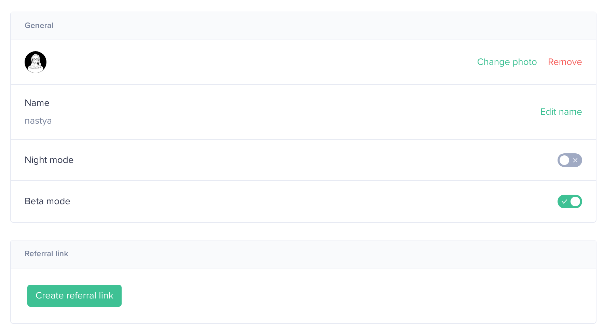
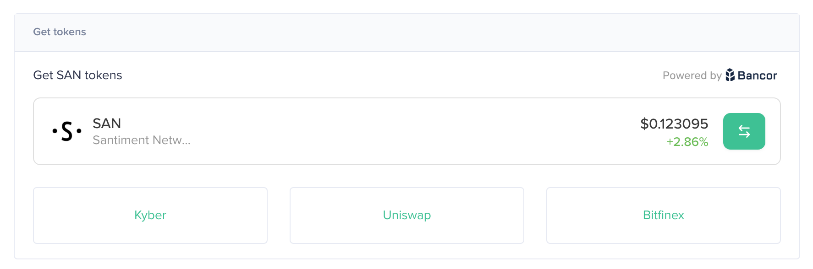

Tune your profile on https://app.santiment.net/account

## General

Depending on your way of logging into Sanbase, there will already be
information displayed in Account Settings when you open them for the
first time.

## Connections and notifications

If you logged in by email first, this section will show your email
address, as displayed in the screenshot below. You can use `Connect
with metamask` to now associate an Ethereum address with the active
account.

If you logged in using MetaMask, it will display your ETH address and
you can now add an email address and username.

Notifications lets you chose through which channels you want to be notified by
Sanbase, e.g. about triggered signals. After connecting an account you
can activate it. Please note that you need Telegram Desktop currently to
connect a Telegram account.

## Get tokens

Should the wallet you used for logging in hold any SAN tokens they would
be displayed under `Get tokens` in the middle of the page.

In case you want to buy SAN tokens, you can find some links to exchanges
offering trading pairs with SAN - or you can use the `Convert` button
to make us of our Bancor integration for this, which you can learn more
about in [this
article](/san-tokens/buy-san-tokens-using-bancor/).

## API key creation

Near the bottom of the page you will find the options to create new and
look at existing API keys. Any created key can also be revoked here. To
find out more about API usage, you can start off by having a look at
[this article](/products-and-plans/create-an-api-key/).

## Subscription

You can upgrade your plan, change billing period or cancel subscription from this block.

