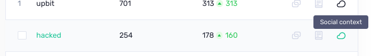
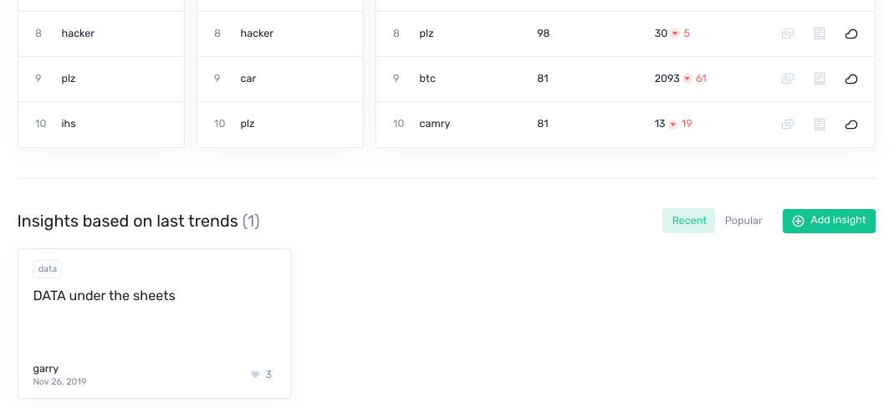

**Emerging trends** page contain `Top 10` trending words in crypto:

Those lists aims to do 2 things:

- Give you a quick overview of the top developing topics in crypto at the moment
- Help you spot hype peaks and local tops

## How is it calculated

This list does NOT calculate the most popular words on crypto social media **overall** - those would often be the same, redundant
words such as `Bitcoin`, `Ethereum`, `crypto` etc.

Instead, our list aims to discover the biggest **developing**
or **emerging** stories within the crypto community. That is
why each day you’ll see a new batch of fresh topics, currently gaining
steam on crypto social media.

To do this, every 9 hours we calculate the top 10 words with the
biggest spike in social media mentions compared to their average
social volume in the previous 2 weeks.

This signals an abnormally high interest in a previously uninspiring
topic, making the list practical for discovering new and developing
talking points in the crypto community.

The results are sourced from more than 1000 crypto-specific social
media channels, including:
- 300+ Telegram groups
- 350+ crypto subreddits
- 30+ of Discord servers
- 500+ Twitter accounts
- BitcoinTalk
- Private trader chats

## How to use it

1. **Get a 1-minute overview of the biggest (developing) stories in crypto**
There’s a lot of noise on crypto social media daily, and dozens of minor or irrelevant stories published on crypto news sites.
Our list filters out this noise to only show what sticks, and eliminate topics and narratives that didn’t get the crowd’s attention. It crowns the **social winners** and weeds out **social losers** so you can pinpoint where the community focus lies at any point.
Our list also often picks up on important stories that fly under the radar of major crypto publications.

2. **Spot local tops and hype peaks**
In our experience so far, we found that a coin ticker’s appearance on the list can be a fairly effective top indicator.
If the coin is already in an uptrend, its presence on our Top 10 list might signal that a local top is nearing, as the hype around the coin reaches its peak.

## Explanation for all columns

Other than the actual words, our list has 5 columns that help bring more context to the results:

- **`Hype Score`** - this is the main criteria for ranking the words on our list. It based on a [sophisticated formula](/metrics/emerging-trends/#hype-score) (developed by Santiment) that analyzes all social media messages, and then - using a dozen parameters - ranks the words by the likelihood of sustained chatter.

The bigger the **Hype Score**, the more likely it is that a particular word/topic will continue to be discussed in the near future, whereas a lower **Hype Score** means that although a word/topic is very popular in crypto at the moment, it’s already slowly losing the crowd’s attention.

While **Social Volume** shows the absolute number of social mentions for each word, the **Hype Score** is much more complex and actually tries to predict which of the top 10 words are more likely to continue to be talked about on crypto social media, and which are starting to fizzle out.

- **`Social Volume`** - shows the total amount of mentions of a word/topic on crypto social media today. The (green or red) number next to it shows how many (more or less) social media mentions the word has had today compared to yesterday.

- **`Icons`**:

 - The first one shows if some words on our list are related, i.e. trending for the same reason. Hovering over the Link icon will highlight all the related words on the list.
- The second one shows if there are any Community Insights written about a particular trending word.
- By clicking the Cloud icon opens the `social context` for a selected word, which gives you additional information about why it’s trending.

 - shows if some words on our list are related, i.e. trending for the same reason. Hovering over the Link icon will highlight all the related words on the list.
The words are linked together whenever someone writes a Community Insight about them. Anyone can do it - here’s how:

## Insights based on last trends

Tick the words that you want add to insight, click `+ Add Insight`
Write an Insight explaining why those words are trending together
Once you publish your insight, those words will be publicly interlinked on our list, and hovering over the Link symbol will highlight the related words for everyone.

You can find daily reports written by our team and other users in [Sanbase Insights](https://insights.santiment.net/)
