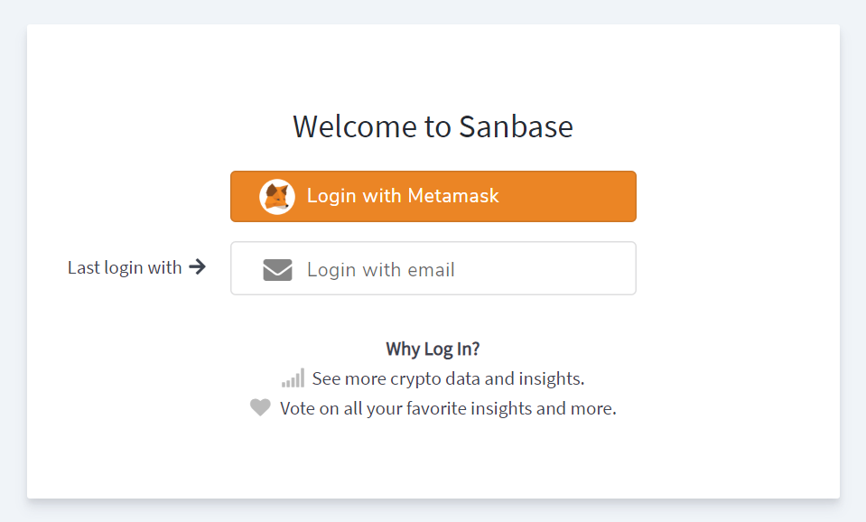
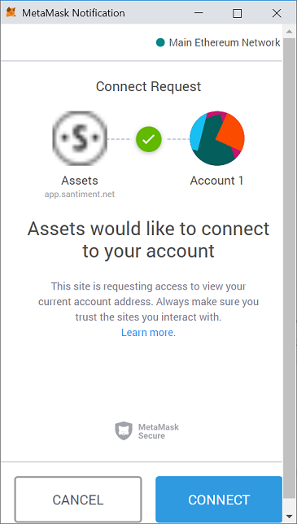
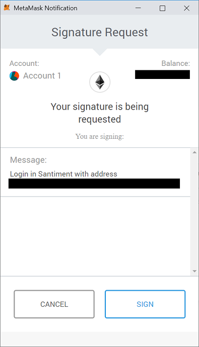

> **ORANGE_TYPE**
> 
> There are two methods to log into Sanbase: through [**MetaMask**](https://metamask.io/) and via **email**. For convenience, both methods can and should be linked to the same account. 

## Logging in to Sanbase Using MetaMask

When you first visit Sanbase at [https://app.santiment.net](https://app.santiment.net), you can find the login option in the upper right corner of the screen. Simply hover your mouse over the last symbol to see it:

Click on `Log in`. This will present you with two options for logging in: using MetaMask or your email. For this guide, choose the MetaMask option.

At this point, the MetaMask plugin will request permission to display your currently selected account's public data on the Sanbase website. Click `Connect` to allow the plugin and the website to communicate.

If you don't see this window, look for the MetaMask icon in the upper right corner of the screen. It should display a small message indicator:

Clicking the MetaMask icon will bring the missing window to the front.

Once MetaMask and Sanbase are connected, you should see the following screen:

Click `Sign in with Metamask`. Another prompt will appear:

Click `SIGN` to securely sign a message with your private key. This action verifies that you are the owner of the connected account. Congratulations, you are now logged into Sanbase.

#### Adding Your Email 

To add your email, hover over the account icon located at the top right corner of the screen. This action will reveal additional options, including 'Account Settings'. 

 

In the 'Account Settings', enter your email address. Once this is done, you can log in using either MetaMask or your email. Regardless of the method you choose, you will be directed to the same account. 

For more information about the 'Account Settings' page, please refer to [this article](/sanbase/account-settings).

## Logging in via Email

Logging into Sanbase via email is a straightforward process. Simply enter your email address, and you will receive a link that directs you to a logged-in Sanbase session. 

If this is your first time logging in via email, you have the option to add an Ethereum (ETH) address. This can be done using MetaMask through the Account Settings page, as mentioned above. 

### Purchasing and Staking SAN Tokens

You are now prepared to stake SAN tokens in order to avail discounts on your access plan. To learn how to stake SAN tokens, please refer to [this article](/san-tokens/connect-a-wallet-to-the-sanbase-account). 

If you need assistance on how to purchase SAN tokens initially, you can find guidance in [this article](/san-tokens/how-to-buy-san).

