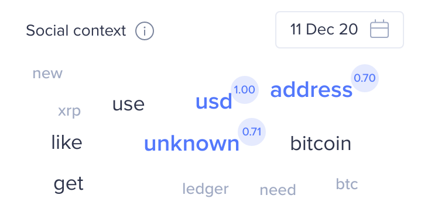

Begin your exploration of trend contexts at [https://app.santiment.net/labs/trends/explore/](https://app.santiment.net/labs/trends/explore/)

The Social Tool enables you to monitor the number of times your search term or phrase is mentioned in a specific medium. This can provide valuable insights into the popularity and discussion surrounding your search term.

## Channels 

To provide relevant results and minimize distractions, we have concentrated on channels where a minimum of 90% of all discussions are centered around cryptocurrency. These channels include:

- Telegram channels
- Reddit 

For further understanding, the results are graphically represented against the price of BTC or ETH. This allows you to correlate market reactions with the overall cryptocurrency discussion:

## Using OR, AND, and Parentheses in Searches

One graph will be displayed for the total mentions, as well as one for each data source. You can use `AND`, `OR`, and parentheses to logically combine multiple search terms. Here are some examples:

- `btc moon` – This will search for the exact phrase "btc moon".
- `btc AND moon` – This will search for messages where both "btc" and "moon" appear. The words do not need to be next to each other.
- `btc OR moon` – This will search for messages where either "btc" or "moon" appears.
- `(btc OR bitcoin) AND moon` – This will search for messages where "moon" appears with either "btc" or "bitcoin".

For examples of how to use this tool, refer to [this blog post](https://santiment.net/blog/introducing-social-trends/). For more information about how it works, refer to [this page](/metrics/social-volume/) and [this article](/metrics/sentiment-metrics/).

## Social Context 

In the sidebar, you will find a feature called `word cloud`. This tool displays the words most frequently used in conjunction with your primary keyword on cryptocurrency social media platforms. The size of the words in the cloud corresponds to their frequency of occurrence in comments that also contain your main keyword. 

