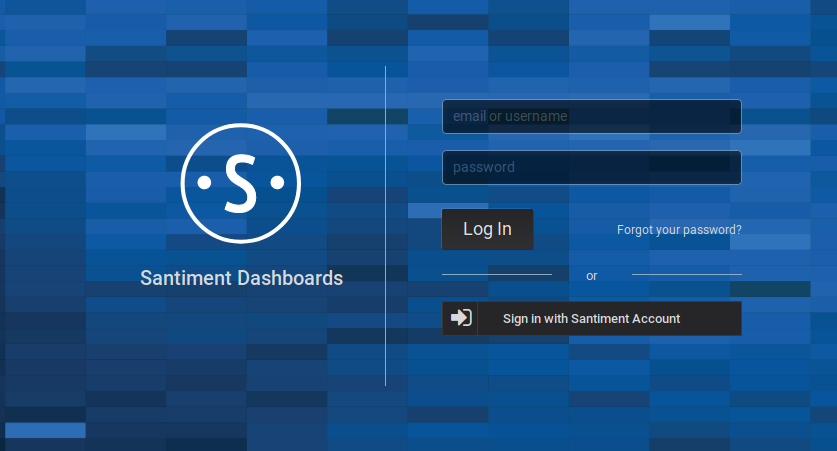

When visiting the Sandata login screen you will be greeted with two login options. One is to log in via a username and password and one is to log in via your Santiment account.

## Login with Santiment account

This option is the normal, recommended way to log into Sandata. When you click on the "Sign in with Santiment Account" button you will be redirected to the Sanbase website. 
Here you log into your Sanbase account. After that you can come back to the Sandata page and should have direct access to it. In case you have difficulties to log into Sanbase you can have a look at [this article](/sanbase/logging-into-sanbase/).

## Login with username and password

This option should only be used in case there are some technical difficulties. If you have trouble getting access to Sandata, you should contact our support team. They can provide you with a password to log in.
