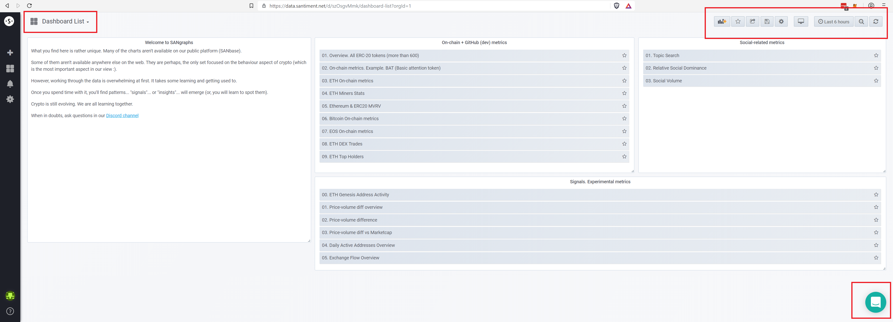
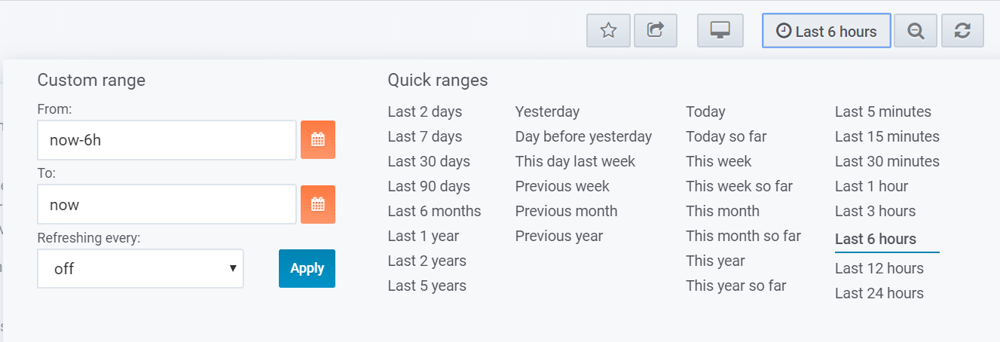

After successfully logging into SANgraphs (in case you need help with
that, check [this
article](/intercom-articles/getting-started/sangraphs/logging-into-sangraphs))
you will see a general overview page. This page already shows most of
SANgraphs navigational elements:

::: {.intercom-container .intercom-align-left}

:::

Metrics list and search - upper left corner {#metrics-list-and-search---upper-left-corner .intercom-align-left data-post-processed="true"}
-------------------------------------------

The first marked area in the upper left of the screenshot is where you
will find a complete list of all available metrics, as well as a search
function. You will be headed here in case the metric you are looking for
is not displayed in one of the lists in the middle of the screen, in
which case you can click on it there instead.

Time frame and other options - upper right corner {#time-frame-and-other-options---upper-right-corner .intercom-align-left data-post-processed="true"}
-------------------------------------------------

Let us have a look at the row of buttons in the upper right corner:

::: {.intercom-container .intercom-align-left}

:::

#### The first three buttons from left to right: {#the-first-three-buttons-from-left-to-right .intercom-align-left data-post-processed="true"}

-   Mark a certain page as a favorite, making it easier to access
    frequently
-   Share the link to the metric(s) you are currently viewing
-   Change the view mode for more screen space, return by pressing
    escape on your keyboard

#### Time frame {#time-frame .intercom-align-left data-post-processed="true"}

The next one is very important within SANgraphs, as it shows (and helps
you select) the time frame for whatever data you are currently looking
at. There is two ways to adjust the time frame, one of which is to click
here, which will open the following panel:

::: {.intercom-container .intercom-align-left}

:::

This will help you select any time frame you might need.

The second option to select a time frame is to click into any of our
metric\'s graphs at the start of the required time frame, hold the
button and drag the mouse to the end of the required time frame and then
release it. This will let you dive down quickly into certain parts of a
graph.

#### The last two buttons {#the-last-two-buttons .intercom-align-left data-post-processed="true"}

-   Zoom out - adjusts the time frame, based on the current one, to give
    you a broader view
-   Refresh the currently displayed data

Get help - lower right corner {#get-help---lower-right-corner .intercom-align-left data-post-processed="true"}
-----------------------------

This is something you might be familiar with from our homepage or
SANbase: The option to get help from the Santiment support team anytime:

::: {.intercom-container .intercom-align-left}

:::

Clicking this will open a chat-like panel which you can use to get in
contact with the support team - or to search [this very knowledge
base](/) you are using right now.
