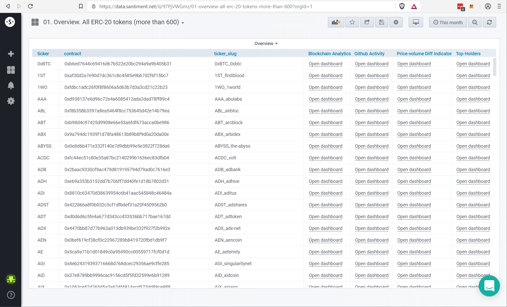

As many of our on-chain (and other) metrics are Ethereum-based, we are
not only able to look at Ether itself, but can apply many of the metrics
to any ERC-20 token that we might be interested in.

When selecting \"01. Overview. All ERC-20 tokens (more than 600)\" from
the starting page of SANgraphs, you will be lead to the following list,
which will allow you to pick the token you want for a certain set of
metrics to be shown for:

::: {.intercom-container .intercom-align-left}

:::

Please note that this is a pretty long list, so the search function of
your browser is your best friend here:

::: {.intercom-container .intercom-align-left}

:::

The first column shows the ticker of the asset, the second one shows the
smart contract address. In case you are also utilizing our API, the
project\'s \'slug\' might be interesting to you, which you can find in
the third column.

The last four columns will lead to different sets of metrics about that
particular token:

-   ***\'Blockchain Analytics\'*** - a huge list of on-chain metrics,
    have a look! For a full list of all metrics listed here, check out
    [this
    article](/intercom-articles/getting-started/sangraphs/the-on-chain-metrics-overview-page).
    It will lead you to articles about the listed metrics in detail,
    too.
-   ***\'Github Activity\'*** - shows how active the development team of
    the project seems to be on Github. We use a certain way to calculate
    this, find out more
    [here](/intercom-articles/metrics-explained/sangraphs/metric-developer-activity).
-   ***\'Price-volume Difference Indicator\'*** - a metric that shows
    when our experimental signal has fired in the past. You can find our
    experimental signals on [our
    Discord](https://santiment.net/discord).
-   ***\'Top Holders\'***  - Find out about the (up to) 100 hundred
    accounts which rank highest in amount of tokens held - and how that
    list changes. Check out [this article
    set](/intercom-articles/metrics-explained/sangraphs/metrics-about-top-holders)
    to learn more.

To find some of these metrics for Ether or Bitcoin, you can use the same
terms and find them via the full metrics list in the upper left corner.
