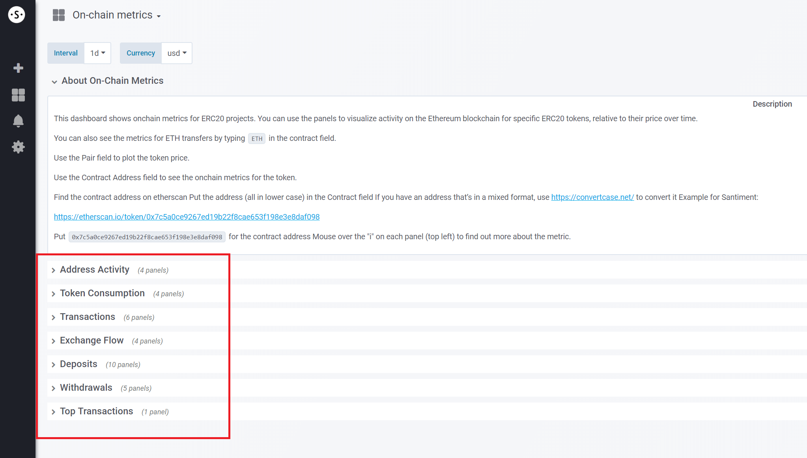

*This article is about the On-chain metrics overview for specific ERC-20
tokens, which can be found through* [*\'The ERC-20 overview
page\'*](/intercom-articles/getting-started/sangraphs/the-erc-20-overview-page)*.
It will list the current metrics that are part of this overview and link
to their respective knowledge base article, where available.\
Please note that \'Top Holders\' metrics, albeit being on-chain in
nature, are not part of this overview and have their own one, which can
be found through the ERC-20 overview page mentioned above.*

ERC-20 on-chain metrics in this overview {#erc-20-on-chain-metrics-in-this-overview .intercom-align-left data-post-processed="true"}
----------------------------------------

The metrics are split into several categories as shown in the
screenshot:

::: {.intercom-container .intercom-align-left}

:::

Clicking one of these categories will expand it to show the included
metrics. Clicking it again will collapse it into the shown state.\

#### Address Activity {#address-activity .intercom-align-left data-post-processed="true"}

-   Daily Active Addresses (DAA) - [article
    link](/intercom-articles/metrics-explained/sangraphs/metric-daily-active-addresses)
-   Network Growth - [article
    link](/intercom-articles/metrics-explained/sangraphs/metric-network-growth)

#### Token Consumption {#token-consumption .intercom-align-left data-post-processed="true"}

-   Average Token Age Consumed in Days - [article
    link](/intercom-articles/metrics-explained/sangraphs/metric-average-token-age-consumed-in-days)
-   Token Age Consumed - [article
    link](/intercom-articles/metrics-explained/sangraphs/metric-token-age-consumed)

#### Transactions {#transactions .intercom-align-left data-post-processed="true"}

-   Transaction Volume - [article
    link](/intercom-articles/metrics-explained/sangraphs/metric-transaction-volume)
-   Token Circulation (Beta) - [article
    link](/intercom-articles/metrics-explained/sangraphs/beta-metric-token-circulation)
-   Velocity of Tokens (Beta) - [article
    link](/intercom-articles/metrics-explained/sangraphs/beta-metric-velocity-of-tokens)

#### Exchange Flow {#exchange-flow .intercom-align-left data-post-processed="true"}

-   Exchange Flow Balance - [article
    link](/intercom-articles/metrics-explained/sangraphs/metric-exchange-flow-balance)
-   Exchange Flow - [article
    link](/intercom-articles/metrics-explained/sangraphs/metric-exchange-flow)
-   Percent of Token Supply on Exchanges

#### Deposits - [article link](/intercom-articles/metrics-explained/sangraphs/metrics-about-deposit-addresses) {#deposits---article-link .intercom-align-left data-post-processed="true"}

-   Daily Active Deposits - [article
    link](/intercom-articles/metrics-explained/sangraphs/metric-daily-active-deposits)
-   Share of Daily Active Deposits in DAA - [article
    link](/intercom-articles/metrics-explained/sangraphs/metric-share-of-daily-active-deposits-in-total-daily-active-addresses)
-   Deposits\' Volume
-   Deposits\' Transactions - [article
    link](/intercom-articles/metrics-explained/sangraphs/metric-deposit-related-transactions)
-   Share of Deposits\' Transactions in Total Transactions - [article
    link](/intercom-articles/metrics-explained/sangraphs/metric-share-of-deposit-transactions-in-total-transactions)

#### Withdrawals {#withdrawals .intercom-align-left data-post-processed="true"}

-   Daily Active Withdrawals
-   Share of Daily Active Withdrawals in DAA
-   Withdrawals\' Volume
-   Withdrawals\' Transactions
-   Share of Withdrawals\' Transactions in Total Transactions

#### Top Transactions {#top-transactions .intercom-align-left data-post-processed="true"}

-   Top 100 Transactions - [article
    link](/intercom-articles/metrics-explained/sangraphs/metric-top-100-transactions)
