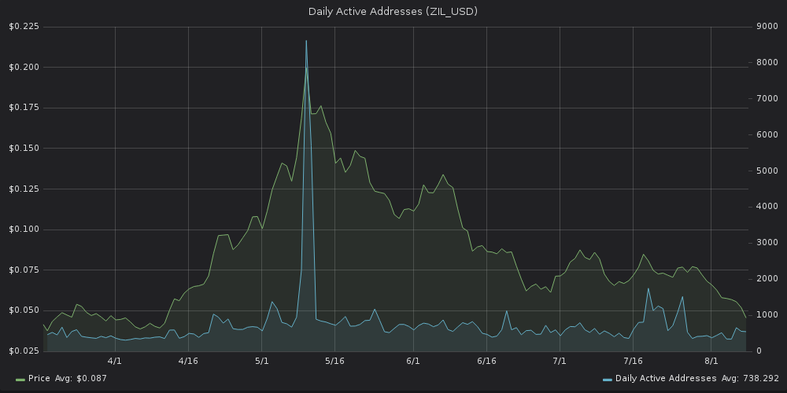

Simply put, DAA indicates the daily level of crowd interaction (or
speculation) with a certain token. We currently offer DAA for BTC, ETH
(including all ERC20 tokens) and EOS.

One potential use case for DAA is identifying the tops. Let's look at an
example:

::: {.intercom-container .intercom-align-left}

:::

This is a DAA graph for [Zilliqa](https://zilliqa.com/), an ERC-20
project that aims to make blockchains faster and more scalable.

As you can see, there's been a giant spike in daily active addresses at
the beginning of May 2018, coinciding with the price rally. But it only
lasted a few days, followed by a rapid decline in price.

A huge spike in DAA can indicate that the interest in a project - both
speculative and otherwise - has peaked.

If the increased network activity proves unsustainable over the coming
days, it could signal an impending downward trend.
