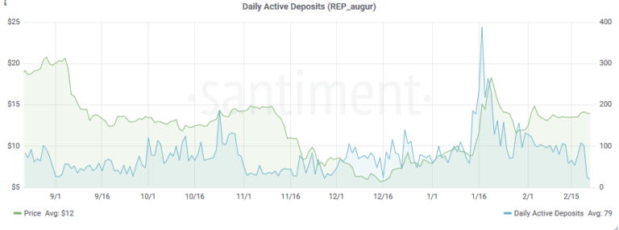

*This article mentions one of several metrics we offer regarding
exchange deposit addresses. Please check* [*this
article*](/intercom-articles/metrics-explained/sangraphs/metrics-about-deposit-addresses)
*for an introduction on deposit addresses and the complete list of
metrics offered.*

Daily active deposits (DAD) shows the **number of unique deposit
addresses** that have been active on a particular day.

As an example, let's look at the DAD metric for REP, Augur's native
coin. REP's price is in green, while Daily Active Deposits are colored
blue.

::: {.intercom-container .intercom-align-left}

:::

The first thing we can see is a more-less stable DAD spread over the
past 6 month. On average, 43 deposit addresses were active on the Augur
network each day.

Compared to other ERC-20 tokens, that's not a bad tally. For example,
over the same time period, SONM recorded an average of 10 DAD, while SNT
(Status) had 27, despite it being one of the most actively developed
ERC-20 projects.

In contrast, OMG -- one of the most active tokens on the Ethereum
network -- boasts an average of 110 DAD.
