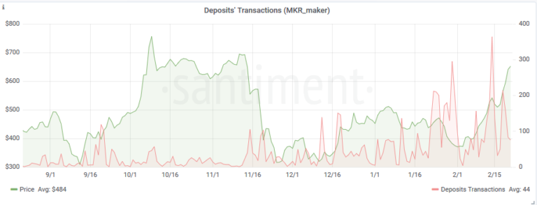

*This article mentions one of several metrics we offer regarding
exchange deposit addresses. Please check* [*this
article*](/sangraphs/metrics/deposit-addresses)
*for an introduction on deposit addresses and the complete list of
metrics offered.*

Deposit-related Transactions shows the total number of all **incoming
and outcoming transactions** involving deposit addresses on a particular
day.

As such, this metric accounts for both user-to-exchange transactions:

1.  from a personal wallet to a deposit address, and
2.  from a deposit address to the main exchange wallet.

Deposit-related Transactions is often valuable when used in conjunction
with **Exchange Inflow** -- [another one of our
metrics](/sangraphs/metrics/exchange-flow)
-- which shows the total amount of coins moving to exchange wallets on a
particular day.

So, for example, an **increase in exchange inflow** but a **plateauing
number of deposit-related transactions** means that more coins are
entering the exchanges, although the number of transactions to the
exchanges stayed the same. In other words, **the average deposit size
has increased.**

As another use-case of this metric, let's take a look what
Deposit-related Transactions can tell us about MKR's popularity over
time:

The Transaction graph clearly shows a steady increase in the total
number of deposit-related transactions -- **especially** in the past few
weeks. In other words, the speculative interest in Maker seems to be
blooming.

It's also noteworthy that the Transaction Number metric really started
breaking out in Autumn, coinciding with Maker's surge in popularity.
