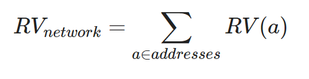
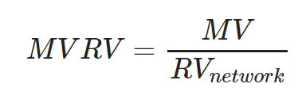

*This metric can be found on the* [*`Ethereum & ERC20 MVRV`
page*](https://data.santiment.net/d/4BpXRALik/05-ethereum-and-erc20-mvrv?orgId=1)
*in Sangraphs, along with the NVT metric which is described in* [*this
article*](/sangraphs/metrics/nvt-ratio)*.*

To understand the MVRV metrics, we have to establish two term. `MV` as
in `market value` simply describes the market cap, which is well known
when looking at crypto assets. The second part is the `RV` or
`realized value`:

Realized Value

The **realized value** metric is calculating the acquisition cost of the
assets located in a wallet. Imagine that there is a wallet which has 30
tokens and these tokens came into the wallet in 3 transactions:

-   10 tokens came in when the price of the tokens was $5
-   5 tokens came in when the price was $15
-   15 tokens came when the price was $10

The realized value of the address is

10 ∗ 5 + 5 ∗ 15 + 15 ∗ 10 = 50 + 75 + 150 = $275

This number gives the value of the tokens for this particular token
holder and can be compared to the current market value. If the current
price of the token is below $9.1, then the money this holder paid for
acquiring these assets are more than their current value, while if the
price is over $9.1, the value is greater. That means that if the
current price is $10, these tokens are worth $300 and if the holder
sells everything, he will get $25 profit.

The interesting part is that we can compute the realized value across
the whole network, by summing the realized values of all wallets holding
tokens at the moment. This number gives an estimate of the amount of
money the users of the network spend to acquire their assets. The
definition will be:

MVRV Ratio

If we compare the current **market capitalization (market value or MV)**
to the current realized value, we can get an estimate how overvalued or
undervalued the current market cap is. The definition will be:

For example if the current realized value is $4b and the market value
is $8b, that means that on average each participant will take 2x
profits if he liquidates his tokens. The more this ratio increases, the
more people will be willing to sell and take profits.

If the MVRV is below 1, then the market is "undervalued" on average,
meaning most people will be realizing losses if they sell their
holdings.

Keep in mind that this is in the ideal case and does not account for the
addresses with lost private keys. The way to adjust for this is to look
at the historical values for the MVRV ratio. As the ratio is approaching
historical maximums or minimums, then the possibility of a highly
overvalued or undervalued market is much higher.
