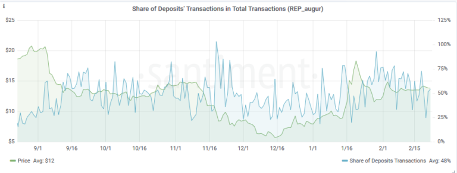
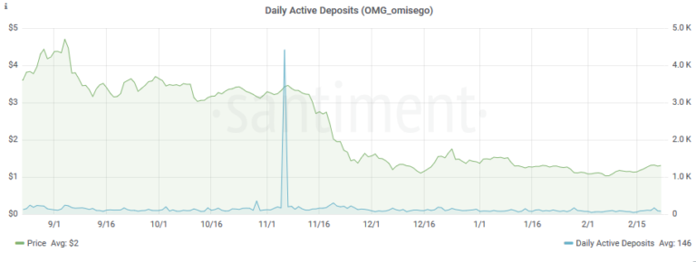

*This article mentions one of several metrics we offer regarding
exchange deposit addresses. Please check* [*this
article*](/intercom-articles/metrics-explained/sangraphs/metrics-about-deposit-addresses)
*for an introduction on deposit addresses and the complete list of
metrics offered.*

\
The SDT metric shows the share of deposit-related transactions in the
total number of transactions on a network.

The main goal remains to measure the level of speculative interest in a
coin -- but from another perspective.

**SDT** is particularly useful when combined with **Daily Active
Deposits** and their **share in total daily active addresses (SDD).**

For example, it could be the case that a relatively small number of
deposit addresses generates a **disproportionately large**amount of
transactions on the network. Or vice versa -- a large number of deposit
addresses generate a relatively small amount of network transactions,
indicating that a token is used predominantly for its utility.

The former seems to be the case with REP. If we look at Augur over the
last 6 months, we'd find just **30% of deposit addresses** (on average)
responsible for **50% of all network transactions:**

::: {.intercom-container .intercom-align-left}

:::

*Share of daily active deposits in DAA over the last 6 months (SDD)
=30%*

::: {.intercom-container .intercom-align-left}

:::

*Share of Deposit-related transactions over the last 6 months = 50%*\

We see another peculiar case in the case of OmiseGo, where the number of
daily active deposits over the last 6 months stayed the same, but the
share of deposit-related transactions significantly increased. This
means that non-deposit addresses now account for comparatively less
transactions, which may indicate a **steady rise of speculative
interest** in the OMG network:

::: {.intercom-container .intercom-align-left}

:::

*A steady number of Daily Active Deposits over the last 6 months (minus
that huge spike)*

::: {.intercom-container .intercom-align-left}

:::

*A gradual increase in share of deposit-related transactions over the
last 6 months*
