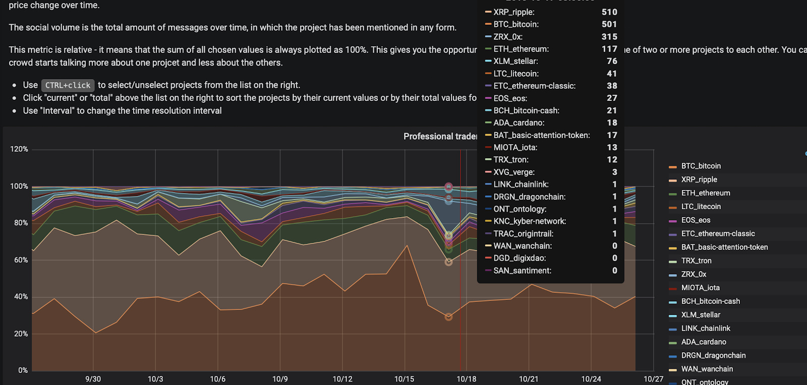

These graphs show the relative social volumes for a set of crypto
assets. The social dominance is measured across 3 different social
channels:

1.  Private trader chats hidden from Google search
2.  Telegram groups
3.  Discord groups

Simply put, whichever token/project commands the most space on the graph
is the most talked-about asset at the time:

::: {.intercom-container .intercom-align-left}

:::

Per the above graph, almost 70% of social chatter on October 15th 2018
revolved around Bitcoin (the massive orange area at the bottom of the
graph).

However, only two days later, the discussion has moved on:

::: {.intercom-container .intercom-align-left}

:::

Bitcoin's 'social share' plunged to just 30%, with another project -
Stellar (the blue area near the top) - quickly stealing the spotlight.

That's how Relative Social Dominance can help you spot the community's
hottest 'talking points' - and where the conversation is headed next.
