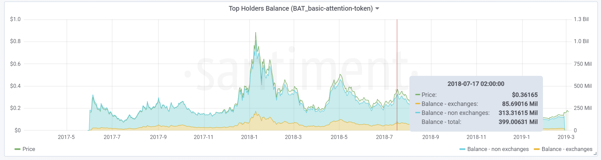

*This article mentions one of several metrics we offer regarding top
holders addresses. Please check* [*this
article*](/intercom-articles/metrics-explained/sangraphs/metrics-about-top-holders)
*for an introduction on `Top Holders` and the complete list of metrics
offered.*

This graph shows the sum of all the top holders balances plotted against
the asset`s price.

As you can see, we also display the total balance split by exchange- and
non-exchange wallets.

The amount of top holders addresses included in the calculation can be
chosen at the top by selecting `HoldersCount`. The HoldersCount in the
above screenshot of BAT`s top holders balances is set to 50.
The assets\`s price can be displayed in USD or BTC, which can be
selected through the `Currency` field at the top. The `Balance in
USD` field lets you switch between displaying the balances in amount of
tokens and displaying them converted to USD.
