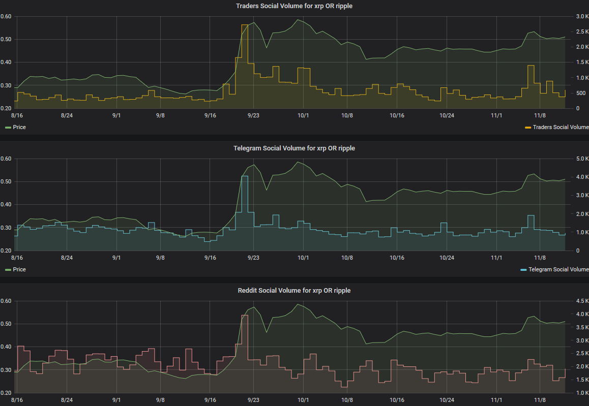

Our custom tool lets you search for any term or phrase, and see how
often it's mentioned on crypto-specific social channels, including:

-   Over 300 different Telegram group
-   Over 300 crypto subreddits
-   Discord channels
-   BitcoinTalk
-   Private trader chats hidden from Google search
-   ... and more to be added

The results can be plotted over the price of BTC, ETH, or any other coin
in our database.

For example, back in September 2018, Ripple (XRP) announced several
strategic partnerships which got people re-excited about the project.

Here's what happens when you search for 'xrp OR ripple' in Topic Search
(OR is a search modifier - in this case, it lets you search for all
messages mentioning either xrp or ripple):

::: {.intercom-container .intercom-align-left}

:::

We can clearly spot a large spike in social chatter surrounding Ripple
in late September, which coincides thoroughly with XRP's price rally.
