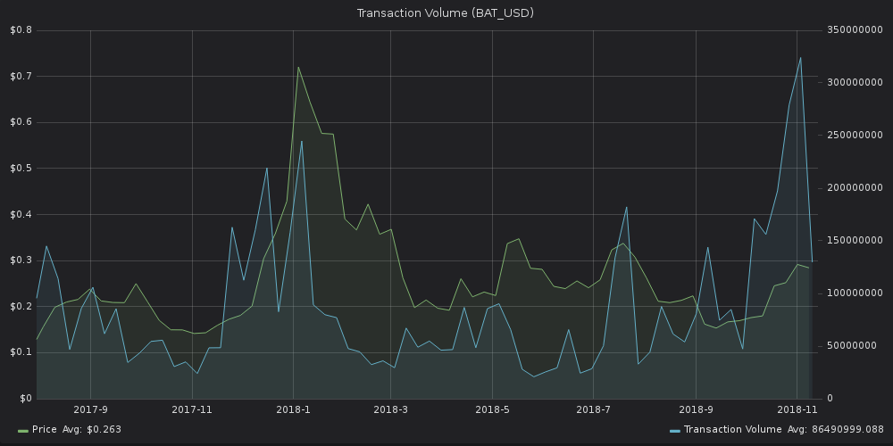

*For a video breakdown of Transaction Volume and Token Velocity, click*
[*here*](https://drive.google.com/file/d/1fAgF96dCsl0RLosL8Fj1p-W0NXBR5onh/view?usp=sharing)*.*

This graph shows the aggregate amount of tokens across all transactions
that happened on the network on a certain date. We currently offer
Transaction Volume for BTC, ETH (including all ERC20 tokens) and EOS.\

A spike in transaction volume either signals:

1.  large amount of tokens moving, or
2.  large number of transactions

While not as strong of a price indicator as some other metrics in our
suite, Transaction Volume can still be used for thorough mid-term
analysis, or in tandem with other indicators.

Here's the trx volume graph for [Basic Attention
Token](https://basicattentiontoken.org/) (BAT), a decentralized ad
network:

::: {.intercom-container .intercom-align-left}

:::

The per-day graph is still a bit noisy, so let's smooth it out with a
7-day moving average (done with 1 click in SANgraphs):

::: {.intercom-container .intercom-align-left}

:::

As you can see, the correlation between price and trx volume can both be
evident and strenuous at different times.

That said, the metric remains a strong complementary signal in any
serious trading analysis.
