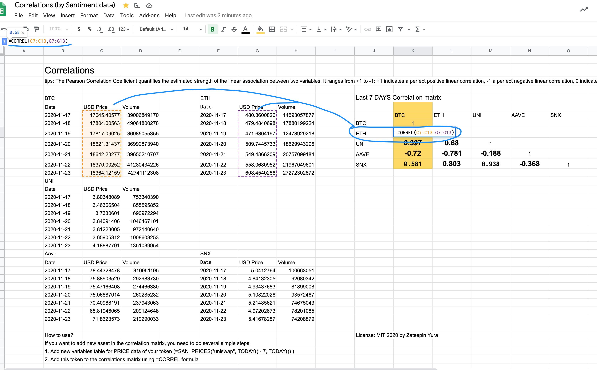
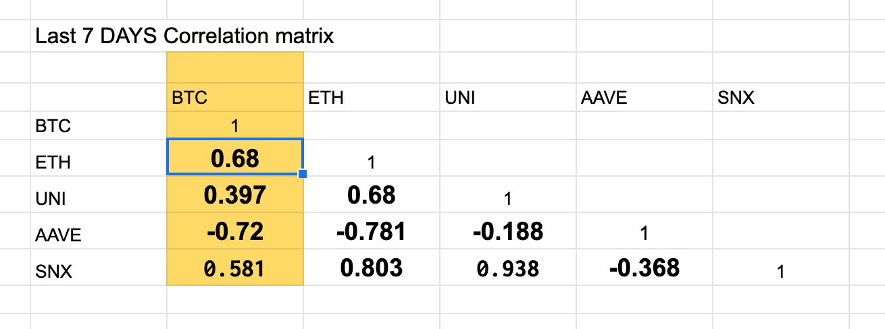

Let's show a sample how powerfull and easy to use Google Sheets Integration of
Santiment data. In this article you will understand how to create a correlation
matrix as Cryptowatch has and a good bonus. You can make a correlation matrix not only for top 20 assets, but for any
crypto assets.

> In the world of finance, correlation is a statistical measure of how two assets move in relation to each other. 

> Simply put, correlation tells us whether two cryptocurrencies move in the same or the opposite direction, or even behave entirely independent of each other. 

> If used properly, coin correlation can elevate your trading in more ways than one. Investing in uncorrelated assets, for example, will help hedge your portfolio and mitigate risk. If you’re not sure where Bitcoin’s headed next and want to protect yourself against losses, taking a position in uncorrelated coins can (in theory) diversify your exposure in case of market correction.

> On the other hand, trading highly correlated assets is more of a risk-on strategy that some may use to amplify their returns. Even during a bull run, Bitcoin rarely does more than +15% in a week. However, mid-cap alts that tend to mirror BTC’s price action could well explode within the same time frame.

To make own correlation matrix you have to resolve 3 steps:
* Fetch pricing data for last 7 days (in case if you want to see correlation
    last 7 days)
* Calculate correlation coefficient
* Organize good visualization for the resulted matrix

[Full sample you can see here](https://docs.google.com/spreadsheets/d/1UcgTvueFeDtv9k2xb2zwFLXtsAnUzy1JsN0KIHvC40I/edit?usp=sharing)

## How to fetch pricing data

It's very easy to do, you need to use SAN functions as in the formula field. ```=SAN_PRICES("bitcoin", TODAY() - 7, TODAY())```

This one function will automatically fill out the last 7 days of Bitcoin’s USD price and trading volume, like you see below:


## How to calculate correlations

Google sheets has built-in function for The Pearson Correlation.
```=CORREL()```
To calculate the Pearson Coefficient for Bitcoin and Ethereum, all you have to do is select the cells with BTC price data (in our case, C7:C13) and the cells with Ethereum price data (G7:G13) under the =CORREL() function, like below:



## Make a good visualization

I suggest you this structure of the matrix, you can check the image below.



> If you want to make a beautifull correlation result
> instead of 0.034343434 -> 0.03 or 2 digits after dot.
> 
> For this you can use built-in feature, you see below
> 

---

Using Sansheets (Google Sheets Integration of Santiment data) is very handy
and flexible. You can organize your own research based on on-chain, social,
financial data without any python/julia code. The sample for this article was
created during 10 minutes.

[Final sample you can see here](https://docs.google.com/spreadsheets/d/1UcgTvueFeDtv9k2xb2zwFLXtsAnUzy1JsN0KIHvC40I/edit?usp=sharing)
